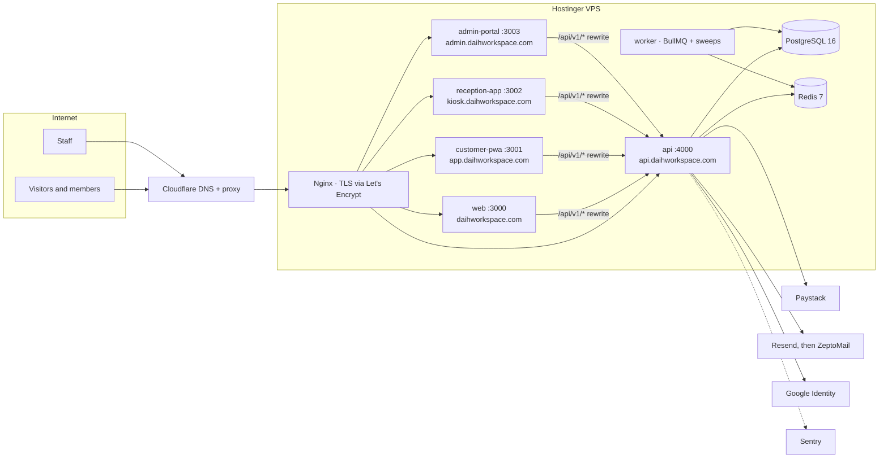

# 02 — Technical Requirements Document

**Product:** DAIH Workspace Platform
**Last updated:** 2026-10-04 (generated from the code at `master` 1dc9e9a)

> Companion documents: [01-PRD](01-PRD.md) · [03-App-Flow](03-App-Flow.md) · [04-UI-UX-Design-Brief](04-UI-UX-Design-Brief.md) · [05-Backend-Schema](05-Backend-Schema.md) · [06-Implementation-Plan](06-Implementation-Plan.md)
> Deeper references: [DAIH_Technical_Design_Document.md](DAIH_Technical_Design_Document.md) (original design rationale) · [DAIH_Deployment_Runbook.md](DAIH_Deployment_Runbook.md) (step-by-step server setup) · [HOSTINGER_VPS_DEPLOYMENT_GUIDE.md](HOSTINGER_VPS_DEPLOYMENT_GUIDE.md) · [DAIH_File_Structure.md](DAIH_File_Structure.md) · [ADR 0001](adr/0001-auth-session-and-identity-events.md)

---

## 1. Architecture

A pnpm + Turborepo monorepo: four Next.js front ends and one Express API (a modular monolith) sharing one PostgreSQL database, one Redis instance and three internal packages.

| Workspace             | Package               | Role                                                                          |
| --------------------- | --------------------- | ----------------------------------------------------------------------------- |
| `apps/web`            | `@daih/web`           | Public marketing site (Bootstrap template, no Tailwind directives)            |
| `apps/customer-pwa`   | `@daih/customer-pwa`  | Member portal: booking, payment, PeeDee wallet, referrals, QR pass            |
| `apps/reception-app`  | `@daih/reception-app` | Front-desk kiosk: QR scan, check-in/out                                       |
| `apps/admin-portal`   | `@daih/admin-portal`  | Staff back office                                                             |
| `apps/api`            | `@daih/api`           | Express API (`dist/server.js`) and background worker (`dist/jobs/worker.js`)  |
| `packages/api-client` | `@daih/api-client`    | Typed client used by every front end                                          |
| `packages/types`      | `@daih/types`         | Shared types, roles and permissions (built to `dist` on install)              |
| `packages/ui`         | `@daih/ui`            | Shared React components (Button, Card, Badge, Input, QRDisplay, Modal, Toast) |
| `packages/config`     | `@daih/config`        | Shared `tsconfig` presets                                                     |

Front ends never talk to the database. Each Next.js app rewrites `/api/v1/*` and `/uploads/*` to the API (`INTERNAL_API_URL`), so browsers make same-origin requests and the refresh cookie stays first-party.

The API is organised into 17 modules under `apps/api/src/modules`: `access`, `booking`, `campaigns`, `catalogue`, `debug`, `discounts`, `docs`, `email`, `events`, `identity`, `legal`, `loyalty`, `notifications`, `payments`, `reports`, `reviews`, `support`. Their endpoints are listed in [05-Backend-Schema §7](05-Backend-Schema.md#7-api-surface).

## 2. Technology stack

Versions are those resolved in `pnpm-lock.yaml` today.

### Backend

| Concern                         | Choice                                                                             |
| ------------------------------- | ---------------------------------------------------------------------------------- |
| Runtime                         | Node.js 20 LTS (`engines.node >= 20.9.0`)                                          |
| HTTP framework                  | Express 4.22                                                                       |
| ORM / migrations                | Prisma 6.19 (`prisma migrate`)                                                     |
| Database                        | PostgreSQL 16 (Docker, `postgres:16-alpine`)                                       |
| Cache, queues, rate-limit store | Redis 7 (Docker, `redis:7-alpine`) via ioredis 5.11                                |
| Jobs                            | BullMQ 5.81 plus interval sweeps in the worker process                             |
| Validation                      | Zod 3.25                                                                           |
| Password hashing                | Argon2id (`argon2`)                                                                |
| Tokens                          | `jsonwebtoken` (access + refresh JWTs)                                             |
| HTTP hardening                  | `helmet` 8, `cors`, `express-rate-limit` 7 with `rate-limit-redis`, `compression`  |
| Images                          | `sharp` (upload processing)                                                        |
| API docs                        | `swagger-ui-express` (OpenAPI at `/api/v1/docs`)                                   |
| Observability                   | Sentry (`@sentry/node` 8.55), Datadog tracer (`dd-trace` 5), `morgan` request logs |

### Frontend

| Concern             | Choice                                                                                                 |
| ------------------- | ------------------------------------------------------------------------------------------------------ |
| Framework           | Next.js 16.3 (App Router, Turbopack builds), React 19.2                                                |
| Styling             | Tailwind CSS 3.4 in `customer-pwa`, `reception-app`, `admin-portal`; Bootstrap 5 template CSS in `web` |
| Icons               | `lucide-react`                                                                                         |
| QR scanning (kiosk) | `html5-qrcode` 2.3                                                                                     |
| HTML sanitising     | `isomorphic-dompurify` / `dompurify` for policy documents                                              |
| Error monitoring    | `@sentry/nextjs` 10.70 (`web`, `customer-pwa`, `admin-portal`)                                         |

### Tooling

| Concern           | Choice                                                                                  |
| ----------------- | --------------------------------------------------------------------------------------- |
| Package manager   | pnpm 10.23 (`packageManager` pinned), `shamefully-hoist=true`                           |
| Monorepo tasks    | Turborepo 2.10 (`build`, `typecheck`, `test`, `dev`)                                    |
| Language          | TypeScript 5.9                                                                          |
| Formatting / lint | Prettier 3.5 — `pnpm lint` is `prettier --check .` across the whole repo, docs included |
| Tests             | Vitest 3.2 + Supertest (API)                                                            |

## 3. Integrations

> **In progress** — Paystack, email, Google sign-in and file-storage details are being generated from the code and will be added to this PR before it is merged.

## 4. Security

> **In progress** — authentication, session, MFA, rate-limiting and data-protection details are being generated from the code and will be added to this PR before it is merged.

## 5. Background processing

> **In progress** — the worker's queues, sweeps and schedules are being generated from the code and will be added to this PR before it is merged.

## 6. Non-functional requirements

> **In progress** — performance, availability and data-retention requirements are being generated from the code and will be added to this PR before it is merged.

## 7. Environment configuration

All configuration is environment variables in a single root `.env` (template: [`.env.example`](../.env.example)). The API loads it at runtime; Next.js apps read `NEXT_PUBLIC_*` values **at build time**, so changing one means rebuilding that app.

| Group                     | Variables                                                                                                                                                                                                                       |
| ------------------------- | ------------------------------------------------------------------------------------------------------------------------------------------------------------------------------------------------------------------------------- |
| Runtime                   | `NODE_ENV`, `PORT`                                                                                                                                                                                                              |
| Data stores               | `DATABASE_URL`, `REDIS_URL`                                                                                                                                                                                                     |
| Secrets                   | `JWT_SECRET`, `JWT_REFRESH_SECRET`, `TOKEN_ENCRYPTION_KEY`, `QR_SIGNING_SECRET`                                                                                                                                                 |
| Token lifetimes           | `JWT_EXPIRES_IN`, `JWT_REFRESH_EXPIRES_IN`, `JWT_REFRESH_DAYS`, `VERIFICATION_EXPIRES_HOURS`, `PASSWORD_RESET_EXPIRES_HOURS`                                                                                                    |
| Refresh cookie            | `COOKIE_DOMAIN`, `COOKIE_PATH`, `COOKIE_SAME_SITE`, `COOKIE_SECURE`                                                                                                                                                             |
| Proxy trust               | `TRUSTED_PROXIES`, `ORIGIN_VERIFY_SECRET`, `ENABLE_DIAGNOSTIC_IP_ENDPOINT`                                                                                                                                                      |
| First super admin (seed)  | `SUPER_ADMIN_EMAIL`, `SUPER_ADMIN_PASSWORD`, `SUPER_ADMIN_FIRST_NAME`, `SUPER_ADMIN_LAST_NAME`, `SUPER_ADMIN_PHONE`                                                                                                             |
| Email                     | `EMAIL_PROVIDER`, `RESEND_API_KEY`, `RESEND_FROM_EMAIL`, `ZEPTOMAIL_API_KEY`, `ZEPTOMAIL_FROM_EMAIL`, `ZEPTOMAIL_API_URL`                                                                                                       |
| Rate limits               | `RATE_LIMIT_LOGIN_*`, `RATE_LIMIT_REGISTER_*`, `RATE_LIMIT_VERIFY_*`, `RATE_LIMIT_RESET_*` (`_MAX`, `_WINDOW`)                                                                                                                  |
| URLs and CORS             | `FRONTEND_CUSTOMER_URL`, `FRONTEND_ADMIN_URL`, `FRONTEND_WEB_URL`, `ALLOWED_ORIGINS`, `INTERNAL_API_URL`                                                                                                                        |
| Front-end public values   | `NEXT_PUBLIC_API_URL`, `NEXT_PUBLIC_WEB_URL`, `NEXT_PUBLIC_CUSTOMER_PWA_URL`, `NEXT_PUBLIC_CUSTOMER_PORTAL_URL`, `NEXT_PUBLIC_RECEPTION_URL`, `NEXT_PUBLIC_ADMIN_URL`, `NEXT_PUBLIC_GOOGLE_CLIENT_ID`, `NEXT_PUBLIC_SENTRY_DSN` |
| Google sign-in            | `GOOGLE_CLIENT_ID` (ID-token flow; no client secret)                                                                                                                                                                            |
| Paystack                  | `PAYSTACK_SECRET_KEY`, `PAYSTACK_PUBLIC_KEY`, `PAYSTACK_WEBHOOK_SECRET`                                                                                                                                                         |
| Object storage (optional) | `S3_ENDPOINT`, `S3_BUCKET`, `S3_ACCESS_KEY`, `S3_SECRET_KEY`, `S3_REGION`                                                                                                                                                       |
| Observability             | `SENTRY_DSN`, `DD_SERVICE`, `DD_ENV`, `DD_VERSION`                                                                                                                                                                              |

Not in the template but read by code: `ENABLE_PROD_DEBUG` (unblocks `/api/v1/debug/*` in production; keep unset).

> **Build-time gotcha.** Turborepo runs in strict environment mode, and `INTERNAL_API_URL` is not declared in `turbo.json`, so `turbo build` strips it and the Next.js rewrites fall back to a self-referencing URL. Until `turbo.json` declares it, production builds must run `pnpm build --env-mode=loose` with `.env` exported.

## 8. Hosting and deployment

| Layer         | Implementation                                                                                                                                                                                                                                                                                         |
| ------------- | ------------------------------------------------------------------------------------------------------------------------------------------------------------------------------------------------------------------------------------------------------------------------------------------------------ |
| DNS and edge  | Cloudflare (proxied records for the apex, `www`, `app`, `kiosk`, `admin`, `api`)                                                                                                                                                                                                                       |
| Server        | One Hostinger VPS                                                                                                                                                                                                                                                                                      |
| Reverse proxy | Nginx, one server block per hostname, real client IP restored from `CF-Connecting-IP`                                                                                                                                                                                                                  |
| TLS           | Let's Encrypt certificates via certbot (auto-renew)                                                                                                                                                                                                                                                    |
| Processes     | PM2, [`ecosystem.config.cjs`](../ecosystem.config.cjs): `daih-api` (4000, 800 MB limit), `daih-worker` (single instance, 20 s graceful stop), `daih-web` (3000), `daih-pwa` (3001), `daih-kiosk` (3002), `daih-admin` (3003); Next apps 600 MB limit, all `fork` mode, one instance each               |
| Data stores   | PostgreSQL and Redis in Docker Compose ([`infra/docker/docker-compose.yml`](../infra/docker/docker-compose.yml)), published on `127.0.0.1` only; Compose also defines a MinIO service for S3-compatible storage                                                                                        |
| Deploy script | [`scripts/deploy.sh`](../scripts/deploy.sh): DB dump to `/var/backups/daih` (keeps 20) → `git reset` to target → `pnpm install --frozen-lockfile` → `prisma migrate deploy` → seed templates and loyalty config → `pnpm build` → `pm2 reload` → health checks, with automatic code rollback on failure |

**CI/CD** — [`.github/workflows/ci.yml`](../.github/workflows/ci.yml):

1. **Validate** (every push to `master`/`main`/`develop` and every PR): Postgres 16 + Redis 7 service containers → `pnpm install --frozen-lockfile` → `prisma generate` → `prisma migrate deploy` → seed email templates → `pnpm lint` → `pnpm typecheck` → `pnpm test` → `pnpm build`.
2. **Deploy** (push to `master`, after Validate): SSH to the VPS and run `scripts/deploy.sh`. Needs repository secrets `VPS_HOST`, `VPS_USER`, `VPS_SSH_KEY`, `VPS_PORT`, `VPS_APP_DIR`.

**Current state:** the deploy secrets are not configured, so production is deployed by hand on the server (see [06-Implementation-Plan](06-Implementation-Plan.md#3-operational-readiness)). `deploy.sh` must also learn to export `.env` and build with `--env-mode=loose` before automatic deploys are switched on.

## 9. Testing

48 test files, all run by `pnpm test` (Vitest): 47 in `apps/api` (31 beside the module source, 16 in `apps/api/tests`) and 1 in `packages/api-client`. CI runs them against real Postgres and Redis containers.

> **In progress** — test coverage by module is being generated from the code and will be added to this PR before it is merged.

There are no component or end-to-end tests for the four front ends.
