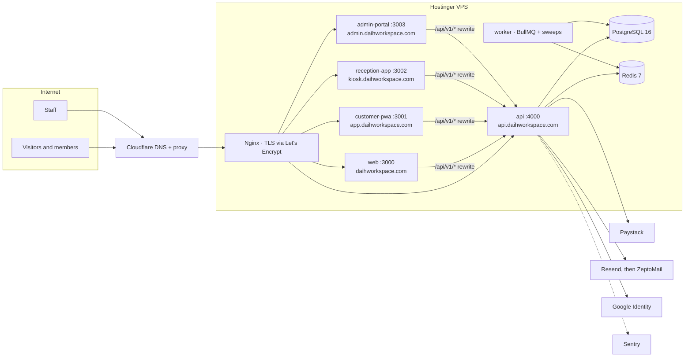

# 02 — Technical Requirements Document

**Product:** DAIH Workspace Platform
**Last updated:** 2026-10-04 (generated from the code at `master` 1dc9e9a)

> Companion documents: [01-PRD](01-PRD.md) · [03-App-Flow](03-App-Flow.md) · [04-UI-UX-Design-Brief](04-UI-UX-Design-Brief.md) · [05-Backend-Schema](05-Backend-Schema.md) · [06-Implementation-Plan](06-Implementation-Plan.md)
> Deeper references: [DAIH_Technical_Design_Document.md](DAIH_Technical_Design_Document.md) (original design rationale) · [DAIH_Deployment_Runbook.md](DAIH_Deployment_Runbook.md) (step-by-step server setup) · [HOSTINGER_VPS_DEPLOYMENT_GUIDE.md](HOSTINGER_VPS_DEPLOYMENT_GUIDE.md) · [DAIH_File_Structure.md](DAIH_File_Structure.md) · [ADR 0001](adr/0001-auth-session-and-identity-events.md)

---

## 1. Architecture

A pnpm + Turborepo monorepo: four Next.js front ends and one Express API (a modular monolith) sharing one PostgreSQL database, one Redis instance and three internal packages.

| Workspace             | Package               | Role                                                                          |
| --------------------- | --------------------- | ----------------------------------------------------------------------------- |
| `apps/web`            | `@daih/web`           | Public marketing site (Bootstrap template, no Tailwind directives)            |
| `apps/customer-pwa`   | `@daih/customer-pwa`  | Member portal: booking, payment, PeeDee wallet, referrals, QR pass            |
| `apps/reception-app`  | `@daih/reception-app` | Front-desk kiosk: QR scan, check-in/out                                       |
| `apps/admin-portal`   | `@daih/admin-portal`  | Staff back office                                                             |
| `apps/api`            | `@daih/api`           | Express API (`dist/server.js`) and background worker (`dist/jobs/worker.js`)  |
| `packages/api-client` | `@daih/api-client`    | Typed client used by every front end                                          |
| `packages/types`      | `@daih/types`         | Shared types, roles and permissions (built to `dist` on install)              |
| `packages/ui`         | `@daih/ui`            | Shared React components (Button, Card, Badge, Input, QRDisplay, Modal, Toast) |
| `packages/config`     | `@daih/config`        | Shared `tsconfig` presets                                                     |

Front ends never talk to the database. Each Next.js app rewrites `/api/v1/*` and `/uploads/*` to the API (`INTERNAL_API_URL`), so browsers make same-origin requests and the refresh cookie stays first-party.

The API is organised into 17 modules under `apps/api/src/modules`: `access`, `booking`, `campaigns`, `catalogue`, `debug`, `discounts`, `docs`, `email`, `events`, `identity`, `legal`, `loyalty`, `notifications`, `payments`, `reports`, `reviews`, `support`. Their endpoints are listed in [05-Backend-Schema §7](05-Backend-Schema.md#7-api-surface).

## 2. Technology stack

Versions are those resolved in `pnpm-lock.yaml` today.

### Backend

| Concern                         | Choice                                                                             |
| ------------------------------- | ---------------------------------------------------------------------------------- |
| Runtime                         | Node.js 20 LTS (`engines.node >= 20.9.0`)                                          |
| HTTP framework                  | Express 4.22                                                                       |
| ORM / migrations                | Prisma 6.19 (`prisma migrate`)                                                     |
| Database                        | PostgreSQL 16 (Docker, `postgres:16-alpine`)                                       |
| Cache, queues, rate-limit store | Redis 7 (Docker, `redis:7-alpine`) via ioredis 5.11                                |
| Jobs                            | BullMQ 5.81 plus interval sweeps in the worker process                             |
| Validation                      | Zod 3.25                                                                           |
| Password hashing                | Argon2id (`argon2`)                                                                |
| Tokens                          | `jsonwebtoken` (access + refresh JWTs)                                             |
| HTTP hardening                  | `helmet` 8, `cors`, `express-rate-limit` 7 with `rate-limit-redis`, `compression`  |
| Images                          | `sharp` (upload processing)                                                        |
| API docs                        | `swagger-ui-express` (OpenAPI at `/api/v1/docs`)                                   |
| Observability                   | Sentry (`@sentry/node` 8.55), Datadog tracer (`dd-trace` 5), `morgan` request logs |

### Frontend

| Concern             | Choice                                                                                                 |
| ------------------- | ------------------------------------------------------------------------------------------------------ |
| Framework           | Next.js 16.3 (App Router, Turbopack builds), React 19.2                                                |
| Styling             | Tailwind CSS 3.4 in `customer-pwa`, `reception-app`, `admin-portal`; Bootstrap 5 template CSS in `web` |
| Icons               | `lucide-react`                                                                                         |
| QR scanning (kiosk) | `html5-qrcode` 2.3                                                                                     |
| HTML sanitising     | `isomorphic-dompurify` / `dompurify` for policy documents                                              |
| Error monitoring    | `@sentry/nextjs` 10.70 (`web`, `customer-pwa`, `admin-portal`)                                         |

### Tooling

| Concern           | Choice                                                                                  |
| ----------------- | --------------------------------------------------------------------------------------- |
| Package manager   | pnpm 10.23 (`packageManager` pinned), `shamefully-hoist=true`                           |
| Monorepo tasks    | Turborepo 2.10 (`build`, `typecheck`, `test`, `dev`)                                    |
| Language          | TypeScript 5.9                                                                          |
| Formatting / lint | Prettier 3.5 — `pnpm lint` is `prettier --check .` across the whole repo, docs included |
| Tests             | Vitest 3.2 + Supertest (API)                                                            |

## 3. Integrations

| Service             | Used for                                                                     | How it is wired                                                                                                                                                              | Notes                                                                                                                                                                                                                                                                                                              |
| ------------------- | ---------------------------------------------------------------------------- | ---------------------------------------------------------------------------------------------------------------------------------------------------------------------------- | ------------------------------------------------------------------------------------------------------------------------------------------------------------------------------------------------------------------------------------------------------------------------------------------------------------------ |
| **Paystack**        | Card payments and refunds                                                    | Hosted checkout (`transaction/initialize`, amount in kobo, callback to the member app's `/bookings`), `transaction/verify`, `refund`; webhooks to `/api/v1/payments/webhook` | Webhooks are verified with the secret key and every `charge.success` is re-checked with the verify API before a booking is confirmed. Mock responses exist only in tests and local development; in production, payments and webhooks are refused until `PAYSTACK_SECRET_KEY` is a real key. Calls have no timeout. |
| **Email**           | Verification, password reset, MFA codes, booking, refund and campaign emails | Resend first, ZeptoMail as fallback, through the BullMQ `notifications` queue                                                                                                | With no provider keys a mock provider is used. A send where both providers fail returns an error result rather than throwing, so the queue does not retry it.                                                                                                                                                      |
| **Google Identity** | Member sign-in                                                               | ID tokens verified with `google-auth-library` against `GOOGLE_CLIENT_ID`; PKCE redirect flow as fallback                                                                     | The member app also needs `NEXT_PUBLIC_GOOGLE_CLIENT_ID` at build time.                                                                                                                                                                                                                                            |
| **Sentry**          | Error monitoring                                                             | `@sentry/nextjs` in `web`, `customer-pwa`, `admin-portal`; `@sentry/node` in the API                                                                                         | The API initialises Sentry only when `SENTRY_DSN` is set and reports from the notification worker and debug route, not from the request error handler.                                                                                                                                                             |
| **Datadog**         | Tracing                                                                      | `dd-trace` in the API                                                                                                                                                        | Needs a Datadog agent on the host to receive traces.                                                                                                                                                                                                                                                               |
| **File storage**    | Avatars and space images                                                     | Local disk (`apps/api/uploads`), served at `/uploads`; images converted to WebP with `sharp` (1920 px spaces, 512 px avatars)                                                | The `S3_*` variables and the Compose MinIO service are not used by the code.                                                                                                                                                                                                                                       |
| **QR codes**        | Member passes, MFA enrolment                                                 | `qrcode` package: passes rendered in the browser, MFA codes rendered by the API                                                                                              | Nothing is sent to a third-party QR service.                                                                                                                                                                                                                                                                       |
| SMS, WhatsApp, push | —                                                                            | Not implemented                                                                                                                                                              | —                                                                                                                                                                                                                                                                                                                  |

## 4. Security

| Area                   | Implementation                                                                                                                                                                                                                                                      |
| ---------------------- | ------------------------------------------------------------------------------------------------------------------------------------------------------------------------------------------------------------------------------------------------------------------- |
| Passwords              | Argon2id (64 MiB memory, 3 iterations, parallelism 4); a dummy hash is checked for unknown emails so response times do not reveal which accounts exist. Minimum 8 characters with upper case, lower case, a digit and a symbol.                                     |
| Sessions               | 15-minute access JWTs plus rotating, hashed refresh tokens in an HttpOnly cookie, with reuse detection — details in [05 §7.1](05-Backend-Schema.md#71-conventions).                                                                                                 |
| MFA                    | Mandatory for every staff role: email code or authenticator app (TOTP secret encrypted with AES-256-GCM).                                                                                                                                                           |
| Authorisation          | Seven roles, 21 permissions, checked on every API route ([05 §7.2](05-Backend-Schema.md#72-roles-and-permissions)). Front-end route guards are for navigation only.                                                                                                 |
| Rate limiting          | Redis-backed limits on sign-in, registration, resends, resets, refresh and OAuth exchange ([05 §7.1](05-Backend-Schema.md#71-conventions)). If Redis is unavailable, requests are let through.                                                                      |
| Transport and headers  | TLS at Nginx (Let's Encrypt) behind Cloudflare. The API uses `helmet` defaults; the Next.js apps send CSP, HSTS (`preload`), `X-Frame-Options: DENY`, `nosniff`, `Referrer-Policy` and `Permissions-Policy`.                                                        |
| CORS                   | Allowlist from `ALLOWED_ORIGINS`, with credentials.                                                                                                                                                                                                                 |
| Input handling         | Zod validation on bodies, queries and params; policy HTML cleaned with `sanitize-html` when saved and DOMPurify when shown.                                                                                                                                         |
| Payments               | Webhook HMAC with the secret key, server-side re-verification of every charge, and an amount/currency/reference check before confirmation.                                                                                                                          |
| QR passes              | `daih_pass_v1.<kid>.<payload>.<sig>` tokens signed with HMAC-SHA256 (`QR_SIGNING_SECRET`), with key rotation.                                                                                                                                                       |
| Startup checks         | In production the API refuses to start unless `JWT_SECRET`, `JWT_REFRESH_SECRET`, `TOKEN_ENCRYPTION_KEY` and `QR_SIGNING_SECRET` are set, distinct and at least 32 characters. A missing or placeholder `PAYSTACK_SECRET_KEY` logs a warning and disables payments. |
| Data protection (NDPA) | Accounts are deactivated, not deleted; a weekly job anonymises customers inactive for 24 months; consent is recorded with the policy version; expired tokens are purged daily.                                                                                      |
| Audit                  | Sensitive actions write `audit_logs` rows; there is no screen to read them yet.                                                                                                                                                                                     |

Outstanding hardening items are listed in [06-Implementation-Plan §5](06-Implementation-Plan.md#5-technical-debt).

## 5. Background processing

Everything asynchronous runs in one process, `daih-worker` ([`jobs/worker.ts`](../apps/api/src/jobs/worker.ts)), kept at a single instance. It needs Redis: verification and reset emails, MFA email codes and webhook processing all stop if the worker or Redis is down.

| Job                     | Schedule                                        | What it does                                                                                                                                                                                                                           |
| ----------------------- | ----------------------------------------------- | -------------------------------------------------------------------------------------------------------------------------------------------------------------------------------------------------------------------------------------- |
| Outbox relay            | Every 3 s, backing off when idle                | Claims `outbox_events` with `FOR UPDATE SKIP LOCKED` and runs the registered handlers. Failed events are retried with exponential back-off and dead-lettered after 5 attempts. Events with no registered handler are marked published. |
| Paystack webhooks       | Every 5 s                                       | Processes stored `webhook_events` (re-verifying each charge with Paystack); up to 3 attempts, then dead-letter.                                                                                                                        |
| Overdue holds           | Every 30 s (plus a BullMQ delayed job per hold) | Expires unpaid 10-minute holds.                                                                                                                                                                                                        |
| No-show / completion    | Every 60 s                                      | Confirmed bookings past their end without a check-in become `NO_SHOW`; checked-in ones become `COMPLETED`.                                                                                                                             |
| System refunds          | Every 15 s                                      | Sends refunds raised automatically by the payment reconciler to Paystack; retries stuck ones. Staff-approved refunds call Paystack at approval time.                                                                                   |
| Deferred campaign sends | Every 5 min                                     | Releases campaign emails held back by quiet hours (21:00–08:00 WAT).                                                                                                                                                                   |
| Token purge             | Daily                                           | Removes expired verification, password-reset and MFA tokens and expired sessions.                                                                                                                                                      |
| Coin expiry             | Daily                                           | Expires PeeDee balances after the configured inactivity period (12 months).                                                                                                                                                            |
| RFM scoring             | Daily                                           | Scores customers for segmentation.                                                                                                                                                                                                     |
| Anonymisation           | Weekly                                          | Anonymises customers inactive for 24 months.                                                                                                                                                                                           |

The BullMQ `notifications` queue (concurrency 5, 3 attempts with back-off) delivers email.

## 6. Non-functional requirements

No targets have been agreed. The table records what the system does today; the targets are **TBD** and should be set from the first full quarter of production data.

| Area           | Today                                                                                                                                     | Target                    |
| -------------- | ----------------------------------------------------------------------------------------------------------------------------------------- | ------------------------- |
| Availability   | One VPS; PM2 restarts crashed processes; no redundancy. `GET /health` returns a static response and does not check the database or Redis. | TBD                       |
| Performance    | Next.js production builds; API compresses responses over 1 KB; loyalty settings cached in Redis for 5 minutes, catalogue cached in Redis  | TBD                       |
| Capacity       | One process per app; the worker must stay single-instance                                                                                 | TBD                       |
| Backups        | `scripts/deploy.sh` dumps the database before every deploy and keeps the last 20; there is no scheduled or off-site backup                | TBD — daily, off-site     |
| Data retention | Anonymisation after 24 months' inactivity; coin expiry after 12 months; daily token purge                                                 | Agreed with legal counsel |
| Observability  | Sentry (front ends; partial in the API), Datadog tracer, PM2 logs; no request IDs                                                         | TBD                       |
| Accessibility  | WCAG 2.2 AA is the bar for new work ([04 §7](04-UI-UX-Design-Brief.md#7-accessibility))                                                   | WCAG 2.2 AA               |

## 7. Environment configuration

All configuration is environment variables in a single root `.env` (template: [`.env.example`](../.env.example)). The API loads it at runtime; Next.js apps read `NEXT_PUBLIC_*` values **at build time**, so changing one means rebuilding that app.

| Group                     | Variables                                                                                                                                                                                                                       |
| ------------------------- | ------------------------------------------------------------------------------------------------------------------------------------------------------------------------------------------------------------------------------- |
| Runtime                   | `NODE_ENV`, `PORT`                                                                                                                                                                                                              |
| Data stores               | `DATABASE_URL`, `REDIS_URL`                                                                                                                                                                                                     |
| Secrets                   | `JWT_SECRET`, `JWT_REFRESH_SECRET`, `TOKEN_ENCRYPTION_KEY`, `QR_SIGNING_SECRET`                                                                                                                                                 |
| Token lifetimes           | `JWT_EXPIRES_IN`, `JWT_REFRESH_EXPIRES_IN`, `JWT_REFRESH_DAYS`, `VERIFICATION_EXPIRES_HOURS`, `PASSWORD_RESET_EXPIRES_HOURS`                                                                                                    |
| Refresh cookie            | `COOKIE_DOMAIN`, `COOKIE_PATH`, `COOKIE_SAME_SITE`, `COOKIE_SECURE`                                                                                                                                                             |
| Proxy trust               | `TRUSTED_PROXIES`, `ORIGIN_VERIFY_SECRET`, `ENABLE_DIAGNOSTIC_IP_ENDPOINT`                                                                                                                                                      |
| First super admin (seed)  | `SUPER_ADMIN_EMAIL`, `SUPER_ADMIN_PASSWORD`, `SUPER_ADMIN_FIRST_NAME`, `SUPER_ADMIN_LAST_NAME`, `SUPER_ADMIN_PHONE`                                                                                                             |
| Email                     | `EMAIL_PROVIDER`, `RESEND_API_KEY`, `RESEND_FROM_EMAIL`, `ZEPTOMAIL_API_KEY`, `ZEPTOMAIL_FROM_EMAIL`, `ZEPTOMAIL_API_URL`                                                                                                       |
| Rate limits               | `RATE_LIMIT_LOGIN_*`, `RATE_LIMIT_REGISTER_*`, `RATE_LIMIT_VERIFY_*`, `RATE_LIMIT_RESET_*` (`_MAX`, `_WINDOW`)                                                                                                                  |
| URLs and CORS             | `FRONTEND_CUSTOMER_URL`, `FRONTEND_ADMIN_URL`, `FRONTEND_WEB_URL`, `ALLOWED_ORIGINS`, `INTERNAL_API_URL`                                                                                                                        |
| Front-end public values   | `NEXT_PUBLIC_API_URL`, `NEXT_PUBLIC_WEB_URL`, `NEXT_PUBLIC_CUSTOMER_PWA_URL`, `NEXT_PUBLIC_CUSTOMER_PORTAL_URL`, `NEXT_PUBLIC_RECEPTION_URL`, `NEXT_PUBLIC_ADMIN_URL`, `NEXT_PUBLIC_GOOGLE_CLIENT_ID`, `NEXT_PUBLIC_SENTRY_DSN` |
| Google sign-in            | `GOOGLE_CLIENT_ID` (ID-token flow; no client secret)                                                                                                                                                                            |
| Paystack                  | `PAYSTACK_SECRET_KEY` (also verifies webhooks), `PAYSTACK_PUBLIC_KEY`                                                                                                                                                           |
| Object storage (optional) | `S3_ENDPOINT`, `S3_BUCKET`, `S3_ACCESS_KEY`, `S3_SECRET_KEY`, `S3_REGION`                                                                                                                                                       |
| Observability             | `SENTRY_DSN`, `DD_SERVICE`, `DD_ENV`, `DD_VERSION`                                                                                                                                                                              |

Not in the template but read by code: `ENABLE_PROD_DEBUG` (unblocks `/api/v1/debug/*` in production; keep unset).

> **Build-time gotcha.** Turborepo runs in strict environment mode, and `INTERNAL_API_URL` is not declared in `turbo.json`, so `turbo build` strips it and the Next.js rewrites fall back to a self-referencing URL. Until `turbo.json` declares it, production builds must run `pnpm build --env-mode=loose` with `.env` exported.

## 8. Hosting and deployment

| Layer         | Implementation                                                                                                                                                                                                                                                                                         |
| ------------- | ------------------------------------------------------------------------------------------------------------------------------------------------------------------------------------------------------------------------------------------------------------------------------------------------------ |
| DNS and edge  | Cloudflare (proxied records for the apex, `www`, `app`, `kiosk`, `admin`, `api`)                                                                                                                                                                                                                       |
| Server        | One Hostinger VPS                                                                                                                                                                                                                                                                                      |
| Reverse proxy | Nginx, one server block per hostname, real client IP restored from `CF-Connecting-IP`                                                                                                                                                                                                                  |
| TLS           | Let's Encrypt certificates via certbot (auto-renew)                                                                                                                                                                                                                                                    |
| Processes     | PM2, [`ecosystem.config.cjs`](../ecosystem.config.cjs): `daih-api` (4000, 800 MB limit), `daih-worker` (single instance, 20 s graceful stop), `daih-web` (3000), `daih-pwa` (3001), `daih-kiosk` (3002), `daih-admin` (3003); Next apps 600 MB limit, all `fork` mode, one instance each               |
| Data stores   | PostgreSQL and Redis in Docker Compose ([`infra/docker/docker-compose.yml`](../infra/docker/docker-compose.yml)), published on `127.0.0.1` only; Compose also defines a MinIO service for S3-compatible storage                                                                                        |
| Deploy script | [`scripts/deploy.sh`](../scripts/deploy.sh): DB dump to `/var/backups/daih` (keeps 20) → `git reset` to target → `pnpm install --frozen-lockfile` → `prisma migrate deploy` → seed templates and loyalty config → `pnpm build` → `pm2 reload` → health checks, with automatic code rollback on failure |

**CI/CD** — [`.github/workflows/ci.yml`](../.github/workflows/ci.yml):

1. **Validate** (every push to `master`/`main`/`develop` and every PR): Postgres 16 + Redis 7 service containers → `pnpm install --frozen-lockfile` → `prisma generate` → `prisma migrate deploy` → seed email templates → `pnpm lint` → `pnpm typecheck` → `pnpm test` → `pnpm build`.
2. **Deploy** (push to `master`, after Validate): SSH to the VPS and run `scripts/deploy.sh`. Needs repository secrets `VPS_HOST`, `VPS_USER`, `VPS_SSH_KEY`, `VPS_PORT`, `VPS_APP_DIR`.

**Current state:** the deploy secrets are not configured, so production is deployed by hand on the server (see [06-Implementation-Plan](06-Implementation-Plan.md#3-operational-readiness)). `deploy.sh` must also learn to export `.env` and build with `--env-mode=loose` before automatic deploys are switched on.

## 9. Testing

48 test files, all run by `pnpm test` (Vitest): 47 in `apps/api` (31 beside the module source, 16 in `apps/api/tests`) and 1 in `packages/api-client`. CI runs them against real Postgres and Redis containers.

**Covered:** the coin ledger, referral, expiry and earning formulas; refunds and the payment reconciler (including gateway mismatches and unverified webhooks); payments RBAC; MFA, Google sign-in, PKCE and CORS; QR token security; discounts; reviews; utilities.

**Not covered:** the wiring between modules' events (which is how the check-in event-name bug in [03 §8](03-App-Flow.md#8-known-flow-gaps) slipped through), notification-worker job types, campaign delivery, and booking date and schedule validation. The 10 loyalty concurrency tests are skipped in CI because `INTEGRATION_TEST_DB_URL` is not set there, and the two k6 load scripts in `apps/api/tests/load` are not run.

There are no component or end-to-end tests for the four front ends.
