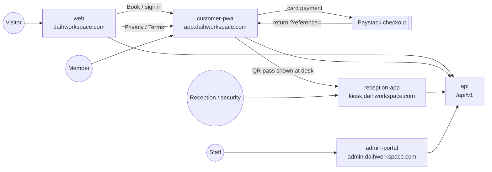

# 03 — App Flow

**Product:** DAIH Workspace Platform
**Last updated:** 2026-10-04 (generated from the code at `master` 1dc9e9a)

> Companion documents: [01-PRD](01-PRD.md) · [02-TRD](02-TRD.md) · [04-UI-UX-Design-Brief](04-UI-UX-Design-Brief.md) · [05-Backend-Schema](05-Backend-Schema.md) · [06-Implementation-Plan](06-Implementation-Plan.md)
> End-user walkthroughs live in [user-guides/](user-guides/README.md). Every screen below exists in the code; flows that look complete but are not wired up are called out where they occur and collected in [§8](#8-known-flow-gaps).

---

## 1. Application map

| App             | Host                        | Users                           | Sign-in                                                |
| --------------- | --------------------------- | ------------------------------- | ------------------------------------------------------ |
| `web`           | `daihworkspace.com`, `www.` | Public                          | None — hands off to the member app                     |
| `customer-pwa`  | `app.daihworkspace.com`     | Members (`CUSTOMER`)            | Email + password or Google; staff accounts are refused |
| `reception-app` | `kiosk.daihworkspace.com`   | Reception and security officers | Staff login                                            |
| `admin-portal`  | `admin.daihworkspace.com`   | All other staff roles           | Staff login with MFA                                   |

## 2. Marketing site (`web`)

**Navigation.**

- **Header:** Home, About Us, Our Plans, Events, Gallery, Jobs, News, Contact.
- **Footer:** plan links, company links, a newsletter box (non-functional, §8), and the Privacy Policy and Terms of Service links. Those two point to the member app, as required on the home page for Google OAuth verification.
- **Booking hand-off:** every "Book" button goes to `app.daihworkspace.com/book/<slug>` (`getPortalBookingUrl` in [`lib/config.ts`](../apps/web/lib/config.ts)).

| Route                                                                                                                                                           | Content                                  | Data                                                |
| --------------------------------------------------------------------------------------------------------------------------------------------------------------- | ---------------------------------------- | --------------------------------------------------- |
| `/`                                                                                                                                                             | Hero, spaces, featured reviews           | `GET /catalogue/resources`, `GET /reviews/featured` |
| `/our-plans`                                                                                                                                                    | All spaces and plans                     | `GET /catalogue/resources`                          |
| `/plans/[slug]`                                                                                                                                                 | One plan                                 | `GET /catalogue/resources/:slug`                    |
| `/[slug]`, `/hot-desk`, `/dedicated-desk`, `/flex-desk`, `/office-suite`, `/private-office`, `/conference-hall`, `/training-room`, `/rooftop-lounge`, `/studio` | Space detail (`WorkspaceDetailView`)     | `GET /catalogue/resources/:slug`                    |
| `/about-us`, `/contact`                                                                                                                                         | About and contact details                | `GET /support` (contact settings)                   |
| `/news`, `/news-single`, `/events`, `/event-single`, `/jobs`, `/gallery`                                                                                        | Static template content                  | None                                                |
| `/privacy`, `/terms`                                                                                                                                            | Redirect (307) to the member app's pages | —                                                   |

The contact form shows a success message but sends nothing (§8).

## 3. Member app (`customer-pwa`)

**Access control is client-side.** `middleware.ts` only sets security headers and the referral cookie. The `(dashboard)` layout waits for the silent refresh (`POST /identity/refresh` using the HttpOnly cookie), then:

- not signed in → `/login?redirectTo=<path>`
- a non-customer role → signed out, back to `/login`
- `onboardingCompleted === false` → `/onboarding`

The access token lives only in memory. It is refreshed every 60 s when close to expiry and on any 401. Logging out in one tab logs out every tab (BroadcastChannel).

**Navigation.**

- **Sidebar** (collapsible on desktop, a drawer on mobile; there is no bottom tab bar): Dashboard · Pricing plans (`/book`) · My Bookings · Entry Key (`/qr`) · Referrals · PD Coins (`/loyalty`) · Settings · **Book a Space** · Support · Logout.
- **Top bar:** notifications bell, help, tier badge, coin balance (→ `/loyalty`), avatar (→ `/settings`).

| Route                                 | Purpose                                                                                | Access                      |
| ------------------------------------- | -------------------------------------------------------------------------------------- | --------------------------- |
| `/`                                   | Redirects to `/dashboard`                                                              | —                           |
| `/login`                              | Email/password and Google sign-in                                                      | Public                      |
| `/register`                           | Sign-up, then a "verify your email" card                                               | Public                      |
| `/verify-email`                       | Verifies `?token=`, or offers a resend                                                 | Public                      |
| `/forgot-password`, `/reset-password` | Request and complete a password reset                                                  | Public                      |
| `/consent`                            | Privacy consent + marketing opt-in for new Google users                                | Public                      |
| `/onboarding`                         | "How did you hear about us?" + friend's referral code (skippable)                      | Signed in (checked in page) |
| `/auth/callback`                      | Completes the Google redirect flow (code exchange)                                     | Public                      |
| `/dashboard`                          | Next bookings, active pass, Wi-Fi card, recent activity, review prompt                 | Signed in                   |
| `/book`                               | Discover spaces (search, category filters)                                             | Signed in                   |
| `/book/[resourceId]`                  | Plan → date → quantity → time → hold → coins → pay (the parameter is the space's slug) | Signed in                   |
| `/book-now`                           | Redirects to `/book`                                                                   | Signed in                   |
| `/bookings`                           | Active and past bookings, payment return, receipts, statements, reviews                | Signed in                   |
| `/qr`                                 | Digital access pass for a confirmed booking                                            | Signed in                   |
| `/loyalty`                            | PeeDee wallet: balance, tier, earning rules, history                                   | Signed in                   |
| `/referrals`                          | Referral code and link, referred members                                               | Signed in                   |
| `/settings`                           | Profile, birthday, avatar, password, account deactivation                              | Signed in                   |
| `/support`                            | Contact options and FAQ (from `GET /support`), ticket form (not wired up, §8)          | Public                      |
| `/privacy`, `/terms`                  | Policies managed in the admin portal                                                   | Public                      |
| `/security`                           | Static trust page                                                                      | Public                      |
| `/offline`                            | Service-worker offline fallback                                                        | Public                      |
| `/debug-sentry`                       | Throws a test error to Sentry                                                          | Public (unrestricted)       |

**Where users land.**

| Event                      | Destination                                                                           |
| -------------------------- | ------------------------------------------------------------------------------------- |
| Sign in                    | `redirectTo` (same-site only), else `/dashboard` (which may forward to `/onboarding`) |
| Register                   | Stays on `/register` with the verify card — no automatic sign-in                      |
| Google sign-in             | `/consent` if consent is needed, then `/onboarding` if needed, then the destination   |
| Onboarding or consent done | `/dashboard`                                                                          |
| Logout or session expiry   | `/login`                                                                              |

**PWA behaviour.**

- The manifest installs the app as "DAIH Member Experience", starting at `/dashboard`.
- The service worker loads pages from the network first, falling back to cache and then `/offline`, and caches static assets.
- API calls are never cached, so no data, not even the QR pass, works offline.
- There is no install prompt and there are no push notifications. Install icons are invalid ([04 §6](04-UI-UX-Design-Brief.md#6-layout-conventions)).

## 4. Reception kiosk (`reception-app`)

> **In progress** — the kiosk's screens and access rules are being generated from the code and will be added to this PR before it is merged.

## 5. Admin portal (`admin-portal`)

> **In progress** — the admin portal's screens, navigation and role rules are being generated from the code and will be added to this PR before it is merged.

## 6. Key flows

> **In progress** — sign-in, booking and payment, check-in, booking states, PeeDee coins, referrals, refunds and staff MFA flows are being generated from the code and will be added to this PR before it is merged.

## 7. Side effects: events, notifications and email

> **In progress** — this section is being generated from the code and will be added to this PR before it is merged.

## 8. Known flow gaps

Each item was checked against the code. Fixes are tracked in [06-Implementation-Plan](06-Implementation-Plan.md).

| #   | Where                           | What happens                                                                                                                                              | Impact                                                                                                       |
| --- | ------------------------------- | --------------------------------------------------------------------------------------------------------------------------------------------------------- | ------------------------------------------------------------------------------------------------------------ |
| 1   | `web` `/contact`                | The form shows a success message, but `handleSubmit` only sets local state                                                                                | Enquiries are silently lost                                                                                  |
| 2   | `web` footer                    | The newsletter form posts to `#`                                                                                                                          | No sign-ups are collected                                                                                    |
| 3   | Member app `/support`           | The ticket form waits 600 ms and shows a random `TKT-` number; no API call is made                                                                        | Members believe they have raised a ticket that staff never see                                               |
| 4   | Member app `/bookings`          | The tabs list only `CONFIRMED`, `CHECKED_IN`, `CHECKED_OUT` and past bookings; `HELD` and `PENDING_PAYMENT` never appear                                  | The hold screen's "View in My Bookings" leads nowhere, and there is no way to pay for or cancel a hold later |
| 5   | Member app checkout             | Sends signed-out users to `/login?redirect=`, but the login page reads `redirectTo`                                                                       | After signing in, members land on the dashboard instead of back at checkout                                  |
| 6   | Member app Google fallback      | Builds `${NEXT_PUBLIC_API_URL}/api/v1/identity/oauth/google`; with `NEXT_PUBLIC_API_URL="/api/v1"` (the documented value) this becomes `/api/v1/api/v1/…` | Google sign-in fails whenever Google's script cannot load                                                    |
| 7   | Google redirect flow, new users | The API redirects to `/consent?code=…`; the consent page reads `?token=`                                                                                  | New Google users on the redirect path cannot complete consent                                                |
| 8   | Wi-Fi details at check-in       | The network name is hardcoded and the PIN is derived from a hash of the booking reference (`access.service.ts`); no network equipment is involved         | The credentials shown are generated by the app, not issued by the network (RADIUS integration is Phase 2)    |
| 9   | Member app `/qr`                | The QR image is fetched from `api.qrserver.com` with the signed access token in the URL                                                                   | The pass fails offline, and the token is shared with a third party                                           |
| 10  | Member app `/debug-sentry`      | A public page that throws a test error; "Gated for Staging" is only a label                                                                               | Anyone can generate Sentry noise                                                                             |
