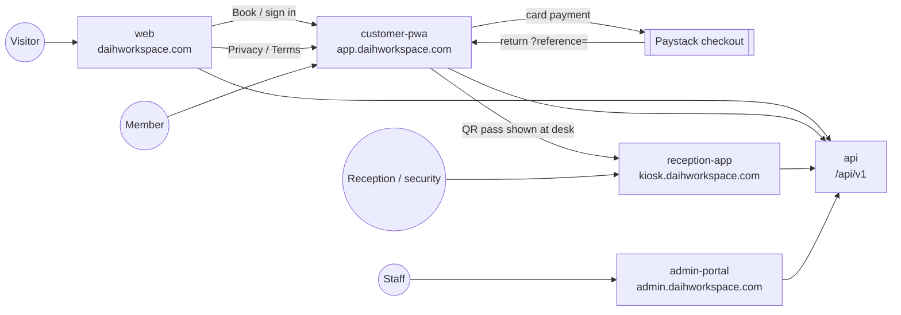
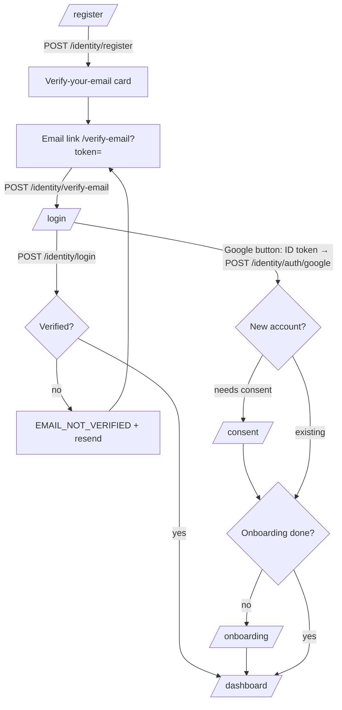
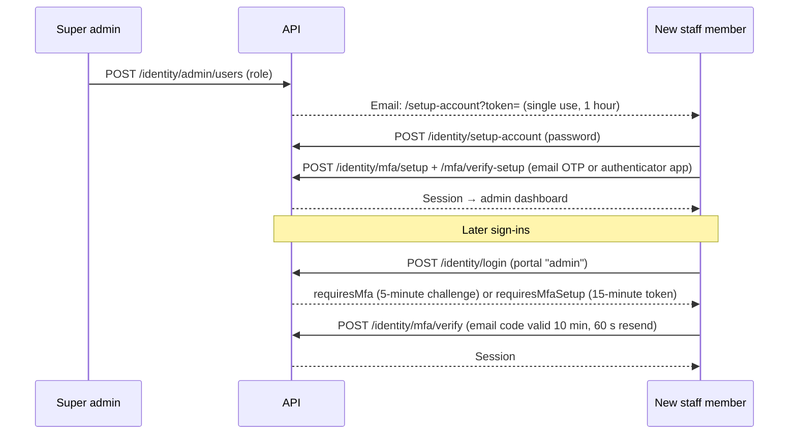
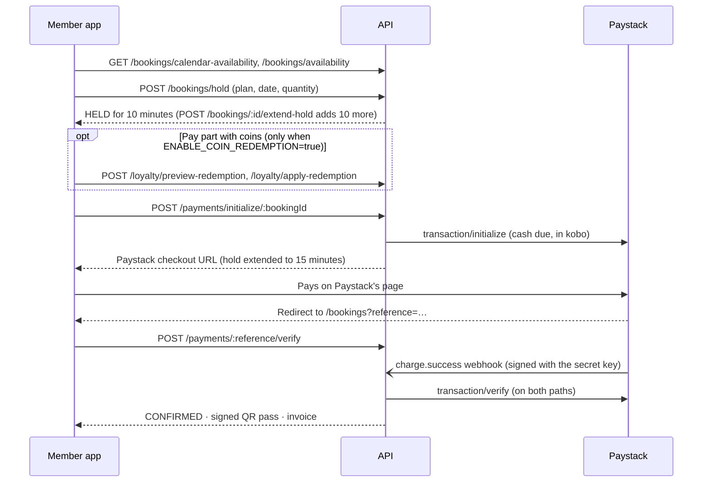
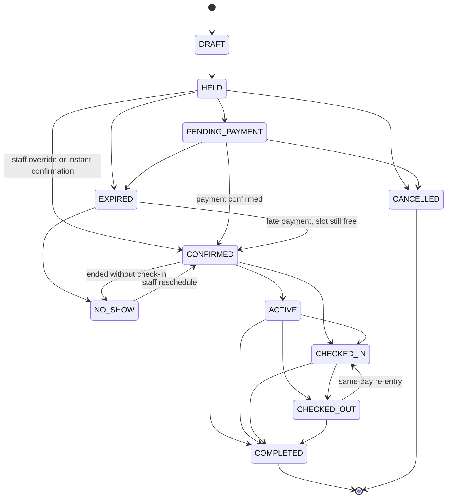
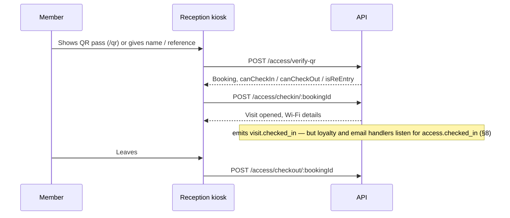

# 03 — App Flow

**Product:** DAIH Workspace Platform
**Last updated:** 2026-10-04 (generated from the code at `master` 1dc9e9a)

> Companion documents: [01-PRD](01-PRD.md) · [02-TRD](02-TRD.md) · [04-UI-UX-Design-Brief](04-UI-UX-Design-Brief.md) · [05-Backend-Schema](05-Backend-Schema.md) · [06-Implementation-Plan](06-Implementation-Plan.md)
> End-user walkthroughs live in [user-guides/](user-guides/README.md). Every screen below exists in the code; flows that look complete but are not wired up are called out where they occur and collected in [§8](#8-known-flow-gaps).

---

## 1. Application map

| App             | Host                        | Users                           | Sign-in                                                |
| --------------- | --------------------------- | ------------------------------- | ------------------------------------------------------ |
| `web`           | `daihworkspace.com`, `www.` | Public                          | None — hands off to the member app                     |
| `customer-pwa`  | `app.daihworkspace.com`     | Members (`CUSTOMER`)            | Email + password or Google; staff accounts are refused |
| `reception-app` | `kiosk.daihworkspace.com`   | Reception and security officers | Staff login                                            |
| `admin-portal`  | `admin.daihworkspace.com`   | All other staff roles           | Staff login with MFA                                   |

## 2. Marketing site (`web`)

**Navigation.**

- **Header:** Home, About Us, Our Plans, Events, Gallery, Jobs, News, Contact.
- **Footer:** plan links, company links, a newsletter box (non-functional, §8), and the Privacy Policy and Terms of Service links. Those two point to the member app, as required on the home page for Google OAuth verification.
- **Booking hand-off:** every "Book" button goes to `app.daihworkspace.com/book/<slug>` (`getPortalBookingUrl` in [`lib/config.ts`](../apps/web/lib/config.ts)).

| Route                                                                                                                                                           | Content                                  | Data                                                |
| --------------------------------------------------------------------------------------------------------------------------------------------------------------- | ---------------------------------------- | --------------------------------------------------- |
| `/`                                                                                                                                                             | Hero, spaces, featured reviews           | `GET /catalogue/resources`, `GET /reviews/featured` |
| `/our-plans`                                                                                                                                                    | All spaces and plans                     | `GET /catalogue/resources`                          |
| `/plans/[slug]`                                                                                                                                                 | One plan                                 | `GET /catalogue/resources/:slug`                    |
| `/[slug]`, `/hot-desk`, `/dedicated-desk`, `/flex-desk`, `/office-suite`, `/private-office`, `/conference-hall`, `/training-room`, `/rooftop-lounge`, `/studio` | Space detail (`WorkspaceDetailView`)     | `GET /catalogue/resources/:slug`                    |
| `/about-us`, `/contact`                                                                                                                                         | About and contact details                | `GET /support` (contact settings)                   |
| `/news`, `/news-single`, `/events`, `/event-single`, `/jobs`, `/gallery`                                                                                        | Static template content                  | None                                                |
| `/privacy`, `/terms`                                                                                                                                            | Redirect (307) to the member app's pages | —                                                   |

The contact form shows a success message but sends nothing (§8).

## 3. Member app (`customer-pwa`)

**Access control is client-side.** `middleware.ts` only sets security headers and the referral cookie. The `(dashboard)` layout waits for the silent refresh (`POST /identity/refresh` using the HttpOnly cookie), then:

- not signed in → `/login?redirectTo=<path>`
- a non-customer role → signed out, back to `/login`
- `onboardingCompleted === false` → `/onboarding`

The access token lives only in memory. It is refreshed every 60 s when close to expiry and on any 401. Logging out in one tab logs out every tab (BroadcastChannel).

**Navigation.**

- **Sidebar** (collapsible on desktop, a drawer on mobile; there is no bottom tab bar): Dashboard · Pricing plans (`/book`) · My Bookings · Entry Key (`/qr`) · Referrals · PD Coins (`/loyalty`) · Settings · **Book a Space** · Support · Logout.
- **Top bar:** notifications bell, help, tier badge, coin balance (→ `/loyalty`), avatar (→ `/settings`).

| Route                                 | Purpose                                                                                | Access                      |
| ------------------------------------- | -------------------------------------------------------------------------------------- | --------------------------- |
| `/`                                   | Redirects to `/dashboard`                                                              | —                           |
| `/login`                              | Email/password and Google sign-in                                                      | Public                      |
| `/register`                           | Sign-up, then a "verify your email" card                                               | Public                      |
| `/verify-email`                       | Verifies `?token=`, or offers a resend                                                 | Public                      |
| `/forgot-password`, `/reset-password` | Request and complete a password reset                                                  | Public                      |
| `/consent`                            | Privacy consent + marketing opt-in for new Google users                                | Public                      |
| `/onboarding`                         | "How did you hear about us?" + friend's referral code (skippable)                      | Signed in (checked in page) |
| `/auth/callback`                      | Completes the Google redirect flow (code exchange)                                     | Public                      |
| `/dashboard`                          | Next bookings, active pass, Wi-Fi card, recent activity, review prompt                 | Signed in                   |
| `/book`                               | Discover spaces (search, category filters)                                             | Signed in                   |
| `/book/[resourceId]`                  | Plan → date → quantity → time → hold → coins → pay (the parameter is the space's slug) | Signed in                   |
| `/book-now`                           | Redirects to `/book`                                                                   | Signed in                   |
| `/bookings`                           | Active and past bookings, payment return, receipts, statements, reviews                | Signed in                   |
| `/qr`                                 | Digital access pass for a confirmed booking                                            | Signed in                   |
| `/loyalty`                            | PeeDee wallet: balance, tier, earning rules, history                                   | Signed in                   |
| `/referrals`                          | Referral code and link, referred members                                               | Signed in                   |
| `/settings`                           | Profile, birthday, avatar, password, account deactivation                              | Signed in                   |
| `/support`                            | Contact options and FAQ (from `GET /support`), ticket form (not wired up, §8)          | Public                      |
| `/privacy`, `/terms`                  | Policies managed in the admin portal                                                   | Public                      |
| `/security`                           | Static trust page                                                                      | Public                      |
| `/offline`                            | Service-worker offline fallback                                                        | Public                      |
| `/debug-sentry`                       | Throws a test error to Sentry                                                          | Public (unrestricted)       |

**Where users land.**

| Event                      | Destination                                                                           |
| -------------------------- | ------------------------------------------------------------------------------------- |
| Sign in                    | `redirectTo` (same-site only), else `/dashboard` (which may forward to `/onboarding`) |
| Register                   | Stays on `/register` with the verify card — no automatic sign-in                      |
| Google sign-in             | `/consent` if consent is needed, then `/onboarding` if needed, then the destination   |
| Onboarding or consent done | `/dashboard`                                                                          |
| Logout or session expiry   | `/login`                                                                              |

**PWA behaviour.**

- The manifest installs the app as "DAIH Member Experience", starting at `/dashboard`.
- The service worker loads pages from the network first, falling back to cache and then `/offline`, and caches static assets.
- API calls are never cached, so no data, not even the QR pass, works offline.
- There is no install prompt and there are no push notifications. Install icons are invalid ([04 §6](04-UI-UX-Design-Brief.md#6-layout-conventions)).

## 4. Reception kiosk (`reception-app`)

Two routes, `/login` and `/`, in one Next.js app built for a front-desk screen.

**Access.**

- `/login` admits reception officers, security officers, operations admins, super admins and management viewers. Finance officers are refused. Staff whose MFA is not set up are told to use the admin portal first.
- `/` checks only that someone is signed in; the API decides what they can do.
- Scan, search, check-in and check-out are allowed for reception, security, operations admin and super admin.
- Shift telemetry is also open to management viewers, so a management viewer can sign in but cannot scan.

**Screen.**

- **Header:** officer name, a clock, mode tabs (Camera · USB scanner · Manual search), and sign-out (shows a "Terminal Locked" screen).
- **Left column:** the scanner, then shift telemetry refreshed every 30 s: check-ins, on site, departures, expected arrivals, and occupancy for the top four spaces.
- **Right column:**
  - The verification card: valid or the rejection reason, name and client ID, booking reference, space, plan, daily window, visit count, and Wi-Fi network/username/PIN.
  - **Check In**, **Check Out** and **Dismiss & Next Scan** buttons.
  - Recent activity.

| Input         | How it identifies the booking                                                         |
| ------------- | ------------------------------------------------------------------------------------- |
| Camera        | `html5-qrcode` reads the member's QR token (an image file can also be scanned)        |
| USB scanner   | Keyboard-wedge text: a QR token or a `DAIH-BK-…` booking reference                    |
| Manual search | Name, email, phone, booking reference, booking ID or client ID (`GET /access/search`) |

API calls:

- `GET /access/terminal-summary`
- `POST /access/verify-qr` returns `canCheckIn`, `canCheckOut` and `isReEntry`.
- `POST /access/checkin/:bookingId` (same-day re-entry is supported).
- `POST /access/checkout/:bookingId` (Wi-Fi stays active until the booking ends).

Every device reports the terminal ID `REC-GATE-01`. There is no walk-in flow on the kiosk.

## 5. Admin portal (`admin-portal`)

**Access.**

- `admin-shell.tsx` sends signed-out users to `/login`.
- `hasRouteAccess(role, path)` in [`lib/rbac.ts`](../apps/admin-portal/lib/rbac.ts) shows an Access Denied view when a role may not open a page. Unknown URLs also show Access Denied, not 404.
- `middleware.ts` only sets headers.
- The real enforcement is the API's per-route checks ([05 §7.3](05-Backend-Schema.md#73-endpoints)). Where the UI offers an action the API refuses, it is listed in [§8](#8-known-flow-gaps).
- Customers are refused at login. Every staff role must use MFA.

**Navigation.**

- **Sidebar** (filtered by role; ⌘/Ctrl+B collapses it and the state is remembered):
  - **Operations & Hub:** Dashboard · Bookings · Operations · Campaigns & AI · Customers · Check-In/Out Logs · Customer Reviews
  - **Finance & Commerce:** Finance · Refund Approvals · Discounts & Promos · Loyalty & PD Coins
  - **Governance & Analytics:** Reports · Staff Management · My Profile · Settings
- **Header:** breadcrumb, a link to the member app, the role pill (→ `/profile`), sign out.
- The Settings sub-pages are reached from buttons on `/settings`.
- There is no notification centre; staff are notified by email.

**What each role sees in the sidebar.**

| Role              | Sidebar items                                                                                      |
| ----------------- | -------------------------------------------------------------------------------------------------- |
| Reception officer | Dashboard, Bookings, Customers, Check-In/Out Logs, My Profile                                      |
| Security officer  | Dashboard, Check-In/Out Logs, My Profile                                                           |
| Management viewer | Dashboard, Check-In/Out Logs, Reports, My Profile                                                  |
| Finance officer   | Reception's set plus Finance, Refund Approvals, Discounts & Promos, Loyalty & PD Coins and Reports |
| Operations admin  | Everything except Staff Management                                                                 |
| Super admin       | Everything                                                                                         |

| Route                                                                                             | Purpose                                                                                                 | Who can open it                                                                   |
| ------------------------------------------------------------------------------------------------- | ------------------------------------------------------------------------------------------------------- | --------------------------------------------------------------------------------- |
| `/`                                                                                               | Dashboard: KPIs, plan mix, top facilities, activity log, occupancy PDF, "Issue Pass" (not wired up, §8) | All staff                                                                         |
| `/bookings`                                                                                       | Search and filter bookings; override, no-show reschedule (reason ≥ 10 characters), raise refund         | Reception, operations, finance, super admin                                       |
| `/operations`                                                                                     | Spaces: details, images, pricing plans, weekly opening hours, blackout dates                            | Operations, super admin                                                           |
| `/operations/campaigns`                                                                           | Campaigns                                                                                               | Operations, super admin                                                           |
| `/operations/reviews`                                                                             | Review moderation, featuring on the homepage, public replies                                            | Operations, super admin                                                           |
| `/customers`                                                                                      | Member directory, add member, referrals, CSV/PDF export (max 1,000 rows)                                | Reception, operations, finance, super admin                                       |
| `/visits`                                                                                         | Check-in/out log (latest 150), CSV export                                                               | All staff (the API refuses finance)                                               |
| `/finance`                                                                                        | Ledger, reconciliation, revenue charts (computed from at most 100 transactions and 100 bookings)        | Finance, operations, super admin                                                  |
| `/finance/refunds`                                                                                | Refund queue with two-person approval                                                                   | Finance, operations, super admin                                                  |
| `/finance/discounts`                                                                              | Discounts and promo codes (create, toggle, delete, redemptions; no edit screen)                         | Finance, operations, super admin                                                  |
| `/finance/loyalty`                                                                                | PeeDee settings, stats, ledger, settings history, manual adjustments                                    | Finance, operations, super admin; settings editable by operations and super admin |
| `/reports`                                                                                        | Analytics by period; revenue and occupancy exports                                                      | Management viewer, finance, operations, super admin                               |
| `/staff` (`/users` redirects here)                                                                | Staff directory, invite, edit, deactivate, resend invite                                                | Super admin                                                                       |
| `/profile`                                                                                        | Own details, avatar, password, MFA method                                                               | All staff                                                                         |
| `/settings`                                                                                       | Hub settings form (does not save, §8) and links to the pages below                                      | Operations, super admin                                                           |
| `/settings/policies`                                                                              | Terms of Service and Privacy Policy editor                                                              | Operations, super admin                                                           |
| `/settings/support`                                                                               | Contact channels and FAQs shown on the public sites                                                     | Operations, super admin                                                           |
| `/settings/email-templates`                                                                       | Transactional email templates                                                                           | Super admin                                                                       |
| `/login`, `/forgot-password`, `/reset-password`, `/setup-account`, `/setup-mfa`, `/access-denied` | Public screens, shown without the sidebar and header                                                    | Public                                                                            |

After login, MFA or account setup, staff land on `/`.

## 6. Key flows

### 6.1 Member sign-up and sign-in

- **Sign-up form:** first name, last name, optional phone, email, optional referral code (prefilled from `?ref=`), a password with five rules, and Terms + Privacy consent (policy version `1.0-2026`).
- **Verification** is a link, not a code.
- **Members who need MFA, and staff accounts,** are refused here and told to use the admin portal. Customers have no MFA.
- **Google sign-in** uses the Google Identity Services button and sends the ID token to the API. If Google's script fails to load, a fallback does a full redirect with PKCE through `/auth/callback`; this fallback is currently broken (§8, items 6–7).
- **Password reset** always answers "if an account exists…", and a completed reset signs out every session.

### 6.2 Staff onboarding and sign-in

- **Who creates accounts:** only a super admin creates staff accounts or assigns the super-admin role.
- **Lockout:** there is none; repeated failures are limited by rate limits (5 per 15 minutes per account, 20 per 15 minutes per IP).
- **Role changes and deactivation** revoke the person's sessions.
- **Password resets** link to the member app's `/reset-password`, even for staff (§8).

### 6.3 Booking and payment

- **Holding a slot.** The hold locks the space's row and adds up overlapping held, pending and confirmed bookings against its capacity. Quantities above 1 are allowed only for hot and flex desks.
- **Price.** The plan price × quantity, minus the single best automatic discount or a promo code (discounts do not stack). No VAT is charged; invoices show zero tax.
- **Confirmation.** Both the webhook and the member's return call ask Paystack for the real result and pass it to the reconciler, which decides in this order:
  1. Transaction already settled → no change.
  2. Paystack reports a failure → `FAILED`.
  3. Paystack's amount, currency or reference differ from the transaction → `REQUIRES_RECONCILIATION` for staff review, no refund.
  4. Booking cancelled or refunded, already confirmed, or its time has passed → `REQUIRES_RECONCILIATION` plus an automatic refund.
  5. Amount differs from the booking's cash due (the price changed) → `FLAGGED_MISMATCH` plus an automatic refund.
  6. Hold still live → `CONFIRMED`: held coins are spent, the QR pass is signed, the invoice (`DAIH-INV-YYYY-NNNNNN`) is created and PeeDee coins are awarded.
  7. Hold expired → capacity is re-checked → `CONFIRMED`, or `REQUIRES_RECONCILIATION` plus an automatic refund.
- **Nothing to pay in cash.** Payment initialisation is refused with `ZERO_CASH_DUE`.
- **Cancelling.** Members can cancel only `HELD` and `PENDING_PAYMENT` bookings. Paid bookings cannot be cancelled; refunds go through staff ([§6.8](#68-refunds)).

### 6.4 Booking states

Transitions come from [`booking.state-machine.ts`](../apps/api/src/modules/booking/booking.state-machine.ts). A sweep every 60 seconds moves bookings past their end time: confirmed without a check-in → `NO_SHOW`; checked in or out → `COMPLETED` (which triggers the review-request email). `REFUND_PENDING` and `REFUNDED` are set by the refund flow, outside this map.

### 6.5 Arrival and check-in

Only reception can check a member in; members cannot check themselves in. Check-in was meant to award the booking's check-in coins, referral rewards and the referee's welcome bonus, and to send a welcome email; because of an event-name mismatch none of these happen today (§8). The member app shows Wi-Fi details once the member is checked in that day. Those details are generated by the app, not issued by the network (§8).

### 6.6 PeeDee coins

1 PD is worth ₦1 by default. Every movement is a ledger row with a unique idempotency key ([05 §4.6](05-Backend-Schema.md#46-peedee-loyalty--referrals)). Settings are edited on the admin portal's Loyalty page.

| Rule              | Configured default                                                                                                                                            | What the code does today                                                      |
| ----------------- | ------------------------------------------------------------------------------------------------------------------------------------------------------------- | ----------------------------------------------------------------------------- |
| Earn on payment   | 1 PD per ₦200 of cash paid (0.5%), minimum spend ₦500                                                                                                         | **Live** — awarded when the payment is confirmed                              |
| Earn on check-in  | 5% × tier multiplier (Bronze 1×, Silver 1.25×, Gold 1.5×)                                                                                                     | **Not firing** — check-in event mismatch (§8)                                 |
| Signup bonus      | 20 PD                                                                                                                                                         | **Live** — on email verification (email sign-up) or account creation (Google) |
| Birthday bonus    | 50 PD a year                                                                                                                                                  | **Not firing** — nothing triggers it                                          |
| Streak bonus      | 30 PD for 4 check-ins in a month                                                                                                                              | **Not firing** — depends on check-in                                          |
| Referral rewards  | See [§6.7](#67-referrals)                                                                                                                                     | **Not firing** — depends on check-in                                          |
| Redemption        | ₦1 per PD, minimum 100 PD, at most 50% of the booking, at least ₦100 left for the card                                                                        | **Off unless** `ENABLE_COIN_REDEMPTION=true` (default off)                    |
| Holds             | Coins reserved against a hold are released if it expires or is cancelled and spent when payment confirms                                                      | Live                                                                          |
| Expiry            | Balance expires after 12 months without a credit (daily job)                                                                                                  | Live; spending coins does not count as activity                               |
| Manual adjustment | Super admin or finance; over 5,000 PD needs a super admin; 20,000 PD per staff member per day; reason code and 20-character justification; no self-adjustment | Live                                                                          |
| Refund clawback   | Coins earned on a refunded booking are reversed                                                                                                               | Referral coins only — earned coins are missed (§8)                            |

### 6.7 Referrals

1. Every member has a code (`REF-XXXXXX`) and a share link on `/referrals`.
2. A link with `?ref=` makes the member app set a `daih_referral_code` cookie for 30 days. The code is attached at sign-up, Google sign-in or onboarding.
3. As configured, the referee gets 200 PD at their first check-in. The referrer earns 5% of the referee's cash spend for 90 days after sign-up: at least 50 PD for the first award, and at most 1,000 PD per referee.
4. Coins from a refunded booking are clawed back from the referrer.

**Today none of these rewards are paid.** They are awarded on check-in, which never reaches the loyalty handler (§8, item "Check-in side effects").

### 6.8 Refunds

Refunds are for the full amount only and need two people.

1. An operations admin or super admin raises a request from `/bookings` or `/finance/refunds`: booking, reason code, and a reason of at least 20 characters.
2. A finance officer or super admin approves, rejects or asks for more information. If asked, the raiser provides it.
3. The person who raised a request cannot approve it (enforced in the UI and the API).
4. Approval calls Paystack's refund API and claws back the coins earned on that booking, including the referrer's coins.
5. Staff are emailed at each step.

### 6.9 Campaigns

1. **Create.** An operations admin or super admin creates a campaign:
   - Types: welcome series, inactive 30 days, birthday, streak, abandoned booking, tier milestone, or custom broadcast.
   - Settings: subject and body, optional coin reward or discount, budget, holdout percentage and frequency cap.
2. **Optional "AI copy".** The modal fills in a fixed template for the campaign type. There is no AI model, and the tone and audience inputs are ignored. Marking copy as "AI" adds a mandatory human approval step (`POST /campaigns/:id/approve-ai`).
3. **Execute.** Campaigns run only when someone presses Execute (`POST /campaigns/:id/execute`). The execute step enforces AI-copy approval, finance or super-admin approval for budgets above ₦50,000, the holdout group, the frequency cap and the coin budget. Quiet hours are 21:00–08:00 WAT; a five-minute job releases deferred sends.
4. **Delivery.** Delivery is email only. Coin rewards are credited when the email is sent. Conversions are attributed from later payments.
5. **Segmentation.** Customer segmentation is rule-based RFM scoring, run from a button and nightly.

Known defects are listed in §8 (double sends, ignored channel, scheduled campaigns never run).

## 7. Side effects: events, notifications and email

Modules communicate through a transactional outbox: a change and its event are written in the same database transaction, and the worker delivers the event to registered handlers ([02 §5](02-TRD.md#5-background-processing)).

| Event                                                                                                                 | Raised when                            | Main effects                                                                                                                                          |
| --------------------------------------------------------------------------------------------------------------------- | -------------------------------------- | ----------------------------------------------------------------------------------------------------------------------------------------------------- |
| `identity.email_verification_requested`                                                                               | Sign-up, resend                        | Verification email                                                                                                                                    |
| `identity.email_verified`, `identity.oauth_registered`                                                                | Email verified; Google account created | Signup bonus                                                                                                                                          |
| `identity.password_reset_requested`                                                                                   | Reset requested                        | Reset email                                                                                                                                           |
| `identity.staff_user_created`                                                                                         | Staff invited                          | Account-setup email                                                                                                                                   |
| `booking.confirmed`                                                                                                   | Payment confirmed or staff override    | Confirmation email; loyalty bookkeeping                                                                                                               |
| `booking.cancelled`, `booking.expired`                                                                                | Hold cancelled or expired              | Coin hold released                                                                                                                                    |
| `booking.rescheduled`                                                                                                 | No-show rescheduled                    | Reschedule email                                                                                                                                      |
| `booking.completed`                                                                                                   | Session ended                          | Review-request email                                                                                                                                  |
| `payment.successful`, `payment.failed`                                                                                | Reconciler                             | Member notifications                                                                                                                                  |
| `payment.capacity_conflict`, `admin.payment_flagged`, `admin.system_refund_failed`, `admin.unknown_payment_reference` | Reconciler and refunds                 | Staff alerts                                                                                                                                          |
| `access.checked_out`                                                                                                  | Check-out                              | Check-out summary email                                                                                                                               |
| `loyalty.clawback_earned`, `loyalty.clawback_referral`, `loyalty.redemption_reversal`                                 | Refunds                                | Coin reversals                                                                                                                                        |
| `visit.checked_in`                                                                                                    | Check-in                               | **No handler** — the loyalty and email handlers subscribe to `access.checked_in`, so check-in coins, referral rewards and the welcome email never run |

Members see in-app notifications in the bell menu (polled every 45 seconds). Staff receive email only.

## 8. Known flow gaps

Each item was checked against the code. Fixes are tracked in [06-Implementation-Plan](06-Implementation-Plan.md).

| #   | Where                           | What happens                                                                                                                                                                                                                                                                                                                        | Impact                                                                                                       |
| --- | ------------------------------- | ----------------------------------------------------------------------------------------------------------------------------------------------------------------------------------------------------------------------------------------------------------------------------------------------------------------------------------- | ------------------------------------------------------------------------------------------------------------ |
| 1   | `web` `/contact`                | The form shows a success message, but `handleSubmit` only sets local state                                                                                                                                                                                                                                                          | Enquiries are silently lost                                                                                  |
| 2   | `web` footer                    | The newsletter form posts to `#`                                                                                                                                                                                                                                                                                                    | No sign-ups are collected                                                                                    |
| 3   | Member app `/support`           | The ticket form waits 600 ms and shows a random `TKT-` number; no API call is made                                                                                                                                                                                                                                                  | Members believe they have raised a ticket that staff never see                                               |
| 4   | Member app `/bookings`          | The tabs list only `CONFIRMED`, `CHECKED_IN`, `CHECKED_OUT` and past bookings; `HELD` and `PENDING_PAYMENT` never appear                                                                                                                                                                                                            | The hold screen's "View in My Bookings" leads nowhere, and there is no way to pay for or cancel a hold later |
| 5   | Member app checkout             | Sends signed-out users to `/login?redirect=`, but the login page reads `redirectTo`                                                                                                                                                                                                                                                 | After signing in, members land on the dashboard instead of back at checkout                                  |
| 6   | Member app Google fallback      | Builds `${NEXT_PUBLIC_API_URL}/api/v1/identity/oauth/google`; with `NEXT_PUBLIC_API_URL="/api/v1"` (the documented value) this becomes `/api/v1/api/v1/…`                                                                                                                                                                           | Google sign-in fails whenever Google's script cannot load                                                    |
| 7   | Google redirect flow, new users | The API redirects to `/consent?code=…`; the consent page reads `?token=`                                                                                                                                                                                                                                                            | New Google users on the redirect path cannot complete consent                                                |
| 8   | Wi-Fi details at check-in       | The network name is hardcoded and the PIN is derived from a hash of the booking reference (`access.service.ts`); no network equipment is involved                                                                                                                                                                                   | The credentials shown are generated by the app, not issued by the network (RADIUS integration is Phase 2)    |
| 9   | Member app `/debug-sentry`      | A public page that throws a test error; "Gated for Staging" is only a label                                                                                                                                                                                                                                                         | Anyone can generate Sentry noise                                                                             |
| 10  | Admin `/settings`               | The main form has no API calls; "Save" only shows a message. It also displays a webhook URL on the old `api.daih.ng` domain                                                                                                                                                                                                         | Hub settings changes are silently discarded                                                                  |
| 11  | Admin dashboard "Issue Pass"    | The walk-in modal waits 600 ms and shows success; packages and prices are hardcoded                                                                                                                                                                                                                                                 | No walk-in booking or payment is recorded                                                                    |
| 12  | Admin booking override          | The client posts to `/bookings/admin/:bookingId/override`; the API route is `/bookings/admin/override`                                                                                                                                                                                                                              | VIP/manual reservations always fail (404)                                                                    |
| 13  | Admin `/bookings`               | The list drops `EXPIRED`, `DRAFT`, `HELD` and `PENDING_PAYMENT` bookings                                                                                                                                                                                                                                                            | "Release Hold" and "Courtesy Discount" can never be used                                                     |
| 14  | Campaign sending                | The service both queues each email and sends it directly; the worker sends queued `campaign.broadcast` jobs too                                                                                                                                                                                                                     | Recipients get every campaign email twice when the worker is running                                         |
| 15  | Campaign channel                | `createCampaign` never saves `channel`                                                                                                                                                                                                                                                                                              | Every campaign is email-only whatever the UI selects                                                         |
| 16  | Scheduled campaigns             | `scheduledAt` and the scheduled/event triggers are stored, but no worker job runs them                                                                                                                                                                                                                                              | Campaigns only ever run when someone presses Execute                                                         |
| 17  | RFM scoring                     | The nightly job writes the RFM tier into `users.acquisitionSource`                                                                                                                                                                                                                                                                  | The member's original acquisition source is overwritten                                                      |
| 18  | Staff password reset            | Reset emails always link to the member app's `/reset-password`                                                                                                                                                                                                                                                                      | Staff reset via the member app; the admin portal's reset page is unused                                      |
| 19  | Staff "Deactivate"              | Sets `isVerified = false` and revokes sessions; there is no separate deactivated state                                                                                                                                                                                                                                              | A deactivated staff member looks like an unverified one                                                      |
| 20  | Audit trail                     | The API writes `audit_logs`, but no endpoint or screen reads them                                                                                                                                                                                                                                                                   | Only the loyalty-settings history is viewable                                                                |
| 21  | Role mismatches                 | The UI shows actions the API refuses: finance can open `/visits`; operations sees "Manual Adjustment" (API: finance or super admin); reception and finance see Override/Reschedule/Refund on `/bookings` (API: operations or super admin); finance sees "Raise refund"; management viewers can sign in to the kiosk but cannot scan | Staff hit 403 errors on buttons they were shown                                                              |
| 22  | Check-in side effects           | `access.service.ts` emits `visit.checked_in`; the loyalty and email handlers are registered for `access.checked_in`, and events with no handler are marked published                                                                                                                                                                | No check-in coins, referral rewards, referee welcome bonus, streak bonus or check-in welcome email           |
| 23  | Coin redemption                 | Redemption at checkout is skipped unless the server sets `ENABLE_COIN_REDEMPTION=true` (default off)                                                                                                                                                                                                                                | Members cannot spend coins on bookings                                                                       |
| 24  | Birthday bonus                  | The ledger supports it, but no job or event awards it                                                                                                                                                                                                                                                                               | No birthday coins are ever paid                                                                              |
| 25  | Refund clawback                 | The clawback looks for `BOOKING_EARN` entries keyed by booking; payment rewards are recorded as `TRANSACTION_REWARD` keyed by transaction                                                                                                                                                                                           | Coins earned on refunded bookings stay with the member                                                       |
| 26  | Discount usage caps             | `confirmRedemptionTx` is never called, so redemptions are not counted                                                                                                                                                                                                                                                               | `maxUsageTotal` limits are not enforced                                                                      |
| 27  | Hold extension                  | `POST /bookings/:id/extend-hold` adds 10 minutes each time, with no limit                                                                                                                                                                                                                                                           | A member can keep a slot held indefinitely without paying                                                    |
| 28  | Staff booking override          | The override path does not check capacity                                                                                                                                                                                                                                                                                           | Staff can overbook a space                                                                                   |
| 29  | Default FAQ                     | The seeded support FAQ says bookings can be cancelled up to 24 hours before the start                                                                                                                                                                                                                                               | Paid bookings cannot be cancelled, so the FAQ contradicts the product                                        |
