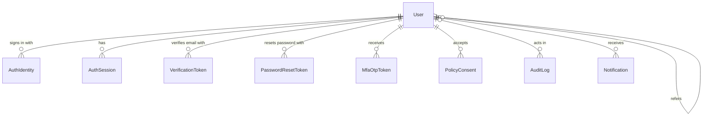
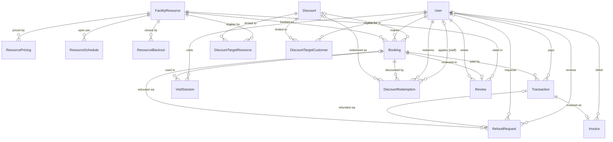
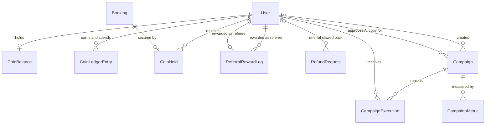

# 05 — Backend Schema & API Surface

**Product:** DAIH Workspace Platform
**Last updated:** 2026-10-04 (generated from the code at `master` 1dc9e9a)
**Sources of truth:** [`schema.prisma`](../apps/api/src/db/prisma/schema.prisma) (39 models, 24 enums) · [migrations](../apps/api/src/db/prisma/migrations) (12) · [`app.ts`](../apps/api/src/app.ts) and `apps/api/src/modules/*/*.routes.ts` (161 endpoints)

> Companion documents: [01-PRD](01-PRD.md) · [02-TRD](02-TRD.md) · [03-App-Flow](03-App-Flow.md) · [04-UI-UX-Design-Brief](04-UI-UX-Design-Brief.md) · [06-Implementation-Plan](06-Implementation-Plan.md)
> Request/response examples live in the [Postman collection](DAIH_Postman_Collection.json) and the running API's OpenAPI document (`/api/v1/docs/openapi.json`). When the schema or routes change, update this file in the same PR.

---

## 1. Data model at a glance

One PostgreSQL 16 database, accessed only by the API through Prisma 6.19. The 39 tables fall into nine domains:

| Domain                       | Tables                                                                                                                                                                |
| ---------------------------- | --------------------------------------------------------------------------------------------------------------------------------------------------------------------- |
| Identity & security          | `users`, `auth_identities`, `auth_sessions`, `verification_tokens`, `password_reset_tokens`, `mfa_otp_tokens`, `policy_consents`, `client_id_sequences`, `audit_logs` |
| Catalogue                    | `facility_resources`, `resource_pricing`, `resource_schedules`, `resource_blackouts`                                                                                  |
| Bookings & visits            | `bookings`, `visit_sessions`                                                                                                                                          |
| Payments, invoices & refunds | `transactions`, `invoices`, `invoice_sequences`, `refund_requests`, `webhook_events`                                                                                  |
| Discounts                    | `discounts`, `discount_target_resources`, `discount_target_customers`, `discount_redemptions`                                                                         |
| PeeDee loyalty & referrals   | `loyalty_settings`, `coin_balances`, `coin_ledger_entries`, `coin_holds`, `referral_reward_logs`                                                                      |
| Campaigns                    | `campaigns`, `campaign_executions`, `campaign_metrics`                                                                                                                |
| Engagement & content         | `reviews`, `review_settings`, `notifications`, `email_templates`, `legal_policies`, `support_settings`                                                                |
| Platform                     | `outbox_events`                                                                                                                                                       |

## 2. Entity relationships

Relationships are drawn from the `@relation` fields in the schema (48 foreign keys). Tables with no foreign keys (`client_id_sequences`, `invoice_sequences`, `outbox_events`, `webhook_events`, `email_templates`, `legal_policies`, `support_settings`, `loyalty_settings`, `review_settings`) are omitted from the diagrams.

### 2.1 Identity & security

### 2.2 Catalogue, bookings, payments, discounts and reviews

### 2.3 PeeDee loyalty, referrals and campaigns

## 3. Enums

| Enum                      | Values                                                                                                                                                                                                    |
| ------------------------- | --------------------------------------------------------------------------------------------------------------------------------------------------------------------------------------------------------- |
| `UserRole`                | `CUSTOMER`, `RECEPTION_OFFICER`, `SECURITY_OFFICER`, `OPERATIONS_ADMIN`, `FINANCE_OFFICER`, `SUPER_ADMIN`, `MANAGEMENT_VIEWER`                                                                            |
| `ResourceCategory`        | `HOT_DESK`, `FLEX_DESK`, `DEDICATED_DESK`, `OFFICE_SUITE`, `CONFERENCE_HALL`, `TRAINING_ROOM`, `ROOFTOP_LOUNGE`, `STUDIO`                                                                                 |
| `BookingState`            | `DRAFT`, `HELD`, `PENDING_PAYMENT`, `CONFIRMED`, `ACTIVE`, `CHECKED_IN`, `CHECKED_OUT`, `COMPLETED`, `CANCELLED`, `EXPIRED`, `NO_SHOW`, `REFUND_PENDING`, `REFUNDED`                                      |
| `PaymentStatus`           | `PENDING`, `SUCCESSFUL`, `FAILED`, `REFUNDED`, `PARTIALLY_REFUNDED`, `ABANDONED`, `EXPIRED`, `FLAGGED_MISMATCH`, `REQUIRES_RECONCILIATION`                                                                |
| `TransactionType`         | `PAYMENT`, `REFUND`                                                                                                                                                                                       |
| `PaymentMethod`           | `PAYSTACK`, `SUBSCRIPTION_CREDIT`, `BANK_TRANSFER`, `POS_TERMINAL`                                                                                                                                        |
| `OutboxStatus`            | `PENDING`, `PROCESSING`, `PUBLISHED`, `FAILED`, `DEAD_LETTER`                                                                                                                                             |
| `MfaMethod`               | `EMAIL_OTP`, `TOTP`                                                                                                                                                                                       |
| `DiscountType`            | `PERCENTAGE`, `FIXED_AMOUNT`, `FIXED_PRICE`                                                                                                                                                               |
| `CustomerEligibility`     | `ALL`, `SPECIFIC_CUSTOMERS`, `FIRST_TIME_ONLY`, `DOMAIN_MATCH`                                                                                                                                            |
| `RedemptionStatus`        | `HELD`, `APPLIED`, `RELEASED`, `REFUNDED`                                                                                                                                                                 |
| `DiscountSource`          | `CUSTOMER_COUPON`, `AUTOMATIC`, `STAFF_OVERRIDE`                                                                                                                                                          |
| `LoyaltyFormulaMode`      | `SPEND_RATIO`, `PERCENTAGE`, `FIXED_AMOUNT`                                                                                                                                                               |
| `ReviewStatus`            | `PENDING`, `APPROVED`, `REJECTED`, `ARCHIVED`                                                                                                                                                             |
| `CoinLedgerAction`        | `BOOKING_EARN`, `REFERRAL_BONUS`, `SIGNUP_BONUS`, `BIRTHDAY_BONUS`, `STREAK_BONUS`, `HOLD_PLACED`, `HOLD_RELEASED`, `HOLD_BURNED`, `EXPIRY`, `ADMIN_ADJUSTMENT`, `REFUND_CLAWBACK`, `REDEMPTION_REVERSAL` |
| `HoldStatus`              | `ACTIVE`, `BURNED`, `RELEASED`                                                                                                                                                                            |
| `RefundStatus`            | `PENDING`, `INFO_REQUESTED`, `APPROVED`, `REJECTED`, `PROCESSED`, `FAILED`, `PROCESSING`, `REQUIRES_RECONCILIATION`                                                                                       |
| `RefundReasonCode`        | `FACILITY_ISSUE`, `SERVICE_FAILURE`, `DUPLICATE_PAYMENT`, `UNAVAILABLE_RESOURCE`, `CUSTOMER_DISPUTE`, `PRICE_CHANGED`, `OTHER`                                                                            |
| `CampaignType`            | `WELCOME_SERIES`, `INACTIVE_30D`, `BIRTHDAY`, `STREAK_ACHIEVEMENT`, `ABANDONED_BOOKING`, `MILESTONE_TIER`, `CUSTOM_BROADCAST`                                                                             |
| `CampaignTriggerType`     | `EVENT`, `SCHEDULED_CRON`, `MANUAL`                                                                                                                                                                       |
| `CampaignChannel`         | `EMAIL`, `IN_APP`, `BOTH`                                                                                                                                                                                 |
| `CampaignStatus`          | `DRAFT`, `SCHEDULED`, `ACTIVE`, `PAUSED`, `COMPLETED`, `ARCHIVED`                                                                                                                                         |
| `CampaignExecutionStatus` | `SENT`, `DELIVERED`, `FAILED`, `DEFERRED_QUIET_HOURS`, `SUPPRESSED_FREQUENCY_CAP`, `SUPPRESSED_BUDGET_CAP`, `SUPPRESSED_HOLDOUT`                                                                          |
| `WebhookEventStatus`      | `PENDING`, `PROCESSING`, `PROCESSED`, `FAILED`, `DEAD_LETTER`                                                                                                                                             |

## 4. Tables

Generated from `schema.prisma`. Relation fields are listed under each table rather than as columns. `?` marks a nullable column.

### 4.1 Identity & security

#### User → `users`

| Column                | Type                | Constraints          |
| --------------------- | ------------------- | -------------------- |
| `id`                  | `String`            | PK, default `uuid()` |
| `email`               | `String`            | unique               |
| `passwordHash`        | `String?`           |                      |
| `firstName`           | `String`            |                      |
| `lastName`            | `String`            |                      |
| `phoneNumber`         | `String?`           |                      |
| `avatarUrl`           | `String?`           |                      |
| `birthday`            | `String?`           |                      |
| `clientId`            | `String`            | unique               |
| `role`                | `UserRole` (enum)   | default `CUSTOMER`   |
| `isVerified`          | `Boolean`           | default `false`      |
| `onboardingCompleted` | `Boolean`           | default `true`       |
| `acquisitionSource`   | `String?`           |                      |
| `mfaEnabled`          | `Boolean`           | default `false`      |
| `mfaMethod`           | `MfaMethod?` (enum) |                      |
| `mfaSecret`           | `String?`           |                      |
| `skipAnonymization`   | `Boolean`           | default `false`      |
| `deactivatedAt`       | `DateTime?`         |                      |
| `createdAt`           | `DateTime`          | default `now()`      |
| `updatedAt`           | `DateTime`          | auto-updated         |
| `referralCode`        | `String?`           | unique               |
| `referredById`        | `String?`           |                      |

Relations: `referredBy` → User?; `referredUsers` → User[]; `identities` → AuthIdentity[]; `bookings` → Booking[]; `transactions` → Transaction[]; `invoices` → Invoice[]; `consents` → PolicyConsent[]; `sessions` → AuthSession[]; `verificationTokens` → VerificationToken[]; `resetTokens` → PasswordResetToken[]; `mfaOtpTokens` → MfaOtpToken[]; `auditLogs` → AuditLog[]; `notifications` → Notification[]; `visitSessions` → VisitSession[]; `customerDiscountRedemptions` → DiscountRedemption[]; `staffDiscountRedemptions` → DiscountRedemption[]; `targetedDiscounts` → DiscountTargetCustomer[]; `referralRewardsGiven` → ReferralRewardLog[]; `referralRewardsReceived` → ReferralRewardLog[]; `reviews` → Review[]; `coinBalance` → CoinBalance?; `coinLedgerEntries` → CoinLedgerEntry[]; `coinHolds` → CoinHold[]; `refundRequestsRaised` → RefundRequest[]; `refundRequestsReviewed` → RefundRequest[]; `refundReferralsClawedBack` → RefundRequest[]; `campaignsCreated` → Campaign[]; `campaignsAiApproved` → Campaign[]; `campaignExecutions` → CampaignExecution[].

Indexes: `@@index([role])`; `@@index([role, isVerified])`; `@@index([createdAt])`; `@@index([referredById])`; `@@index([referredById, createdAt])`; `@@index([referralCode])`; `@@index([deactivatedAt])`.

#### AuthIdentity → `auth_identities`

| Column           | Type       | Constraints          |
| ---------------- | ---------- | -------------------- |
| `id`             | `String`   | PK, default `uuid()` |
| `userId`         | `String`   |                      |
| `provider`       | `String`   |                      |
| `providerUserId` | `String`   |                      |
| `email`          | `String`   |                      |
| `linkedAt`       | `DateTime` | default `now()`      |

Relations: `user` → User.

Indexes: `@@unique([provider, providerUserId])`; `@@index([userId])`.

#### PolicyConsent → `policy_consents`

| Column          | Type       | Constraints          |
| --------------- | ---------- | -------------------- |
| `id`            | `String`   | PK, default `uuid()` |
| `userId`        | `String`   |                      |
| `policyVersion` | `String`   |                      |
| `purpose`       | `String`   |                      |
| `consentedAt`   | `DateTime` | default `now()`      |

Relations: `user` → User.

#### AuthSession → `auth_sessions`

| Column              | Type       | Constraints          |
| ------------------- | ---------- | -------------------- |
| `id`                | `String`   | PK, default `uuid()` |
| `userId`            | `String`   |                      |
| `refreshTokenHash`  | `String`   | unique               |
| `tokenFamily`       | `String`   |                      |
| `ipAddress`         | `String?`  |                      |
| `userAgent`         | `String?`  |                      |
| `deviceFingerprint` | `String?`  |                      |
| `mismatchCount`     | `Int`      | default `0`          |
| `isRevoked`         | `Boolean`  | default `false`      |
| `expiresAt`         | `DateTime` |                      |
| `lastUsedAt`        | `DateTime` | default `now()`      |
| `createdAt`         | `DateTime` | default `now()`      |
| `updatedAt`         | `DateTime` | auto-updated         |

Relations: `user` → User.

Indexes: `@@index([userId])`; `@@index([tokenFamily])`.

#### VerificationToken → `verification_tokens`

| Column      | Type        | Constraints          |
| ----------- | ----------- | -------------------- |
| `id`        | `String`    | PK, default `uuid()` |
| `userId`    | `String`    |                      |
| `tokenHash` | `String`    | unique               |
| `expiresAt` | `DateTime`  |                      |
| `usedAt`    | `DateTime?` |                      |
| `createdAt` | `DateTime`  | default `now()`      |

Relations: `user` → User.

Indexes: `@@index([userId])`.

#### PasswordResetToken → `password_reset_tokens`

| Column      | Type        | Constraints          |
| ----------- | ----------- | -------------------- |
| `id`        | `String`    | PK, default `uuid()` |
| `userId`    | `String`    |                      |
| `tokenHash` | `String`    | unique               |
| `expiresAt` | `DateTime`  |                      |
| `usedAt`    | `DateTime?` |                      |
| `createdAt` | `DateTime`  | default `now()`      |

Relations: `user` → User.

Indexes: `@@index([userId])`.

#### MfaOtpToken → `mfa_otp_tokens`

| Column      | Type        | Constraints          |
| ----------- | ----------- | -------------------- |
| `id`        | `String`    | PK, default `uuid()` |
| `userId`    | `String`    |                      |
| `tokenHash` | `String`    | unique               |
| `expiresAt` | `DateTime`  |                      |
| `usedAt`    | `DateTime?` |                      |
| `createdAt` | `DateTime`  | default `now()`      |

Relations: `user` → User.

Indexes: `@@index([userId])`.

#### ClientIdSequence → `client_id_sequences`

| Column         | Type       | Constraints  |
| -------------- | ---------- | ------------ |
| `year`         | `Int`      | PK           |
| `nextSequence` | `Int`      | default `1`  |
| `updatedAt`    | `DateTime` | auto-updated |

#### AuditLog → `audit_logs`

| Column       | Type       | Constraints          |
| ------------ | ---------- | -------------------- |
| `id`         | `String`   | PK, default `uuid()` |
| `userId`     | `String?`  |                      |
| `action`     | `String`   |                      |
| `entityType` | `String`   |                      |
| `entityId`   | `String`   |                      |
| `metadata`   | `Json?`    |                      |
| `ipAddress`  | `String?`  |                      |
| `createdAt`  | `DateTime` | default `now()`      |

Relations: `user` → User?.

### 4.2 Catalogue

#### FacilityResource → `facility_resources`

| Column        | Type                      | Constraints          |
| ------------- | ------------------------- | -------------------- |
| `id`          | `String`                  | PK, default `uuid()` |
| `name`        | `String`                  |                      |
| `slug`        | `String`                  | unique               |
| `category`    | `ResourceCategory` (enum) |                      |
| `description` | `String`                  |                      |
| `capacity`    | `Int`                     | default `1`          |
| `location`    | `String`                  |                      |
| `amenities`   | `String[]`                |                      |
| `imageUrl`    | `String?`                 |                      |
| `sortOrder`   | `Int`                     | default `0`          |
| `isPopular`   | `Boolean`                 | default `false`      |
| `isActive`    | `Boolean`                 | default `true`       |
| `createdAt`   | `DateTime`                | default `now()`      |
| `updatedAt`   | `DateTime`                | auto-updated         |

Relations: `pricing` → ResourcePricing[]; `schedules` → ResourceSchedule[]; `blackouts` → ResourceBlackout[]; `bookings` → Booking[]; `targetedDiscounts` → DiscountTargetResource[]; `reviews` → Review[].

#### ResourcePricing → `resource_pricing`

| Column           | Type        | Constraints          |
| ---------------- | ----------- | -------------------- |
| `id`             | `String`    | PK, default `uuid()` |
| `resourceId`     | `String`    |                      |
| `planName`       | `String`    |                      |
| `durationHours`  | `Int?`      |                      |
| `durationDays`   | `Int?`      |                      |
| `durationMonths` | `Int?`      |                      |
| `price`          | `Decimal`   | db `Decimal(12, 2)`  |
| `currency`       | `String`    | default `"NGN"`      |
| `isPopular`      | `Boolean`   | default `false`      |
| `isActive`       | `Boolean`   | default `true`       |
| `isNightPlan`    | `Boolean`   | default `false`      |
| `operatingHours` | `String?`   |                      |
| `effectiveFrom`  | `DateTime`  | default `now()`      |
| `effectiveTo`    | `DateTime?` |                      |
| `createdAt`      | `DateTime`  | default `now()`      |
| `updatedAt`      | `DateTime`  | auto-updated         |

Relations: `resource` → FacilityResource.

#### ResourceSchedule → `resource_schedules`

| Column       | Type       | Constraints          |
| ------------ | ---------- | -------------------- |
| `id`         | `String`   | PK, default `uuid()` |
| `resourceId` | `String`   |                      |
| `dayOfWeek`  | `Int`      |                      |
| `openTime`   | `String`   | default `"08:00"`    |
| `closeTime`  | `String`   | default `"20:00"`    |
| `is24Hours`  | `Boolean`  | default `false`      |
| `isClosed`   | `Boolean`  | default `false`      |
| `createdAt`  | `DateTime` | default `now()`      |
| `updatedAt`  | `DateTime` | auto-updated         |

Relations: `resource` → FacilityResource.

Indexes: `@@unique([resourceId, dayOfWeek])`.

#### ResourceBlackout → `resource_blackouts`

| Column            | Type       | Constraints          |
| ----------------- | ---------- | -------------------- |
| `id`              | `String`   | PK, default `uuid()` |
| `resourceId`      | `String`   |                      |
| `startDate`       | `DateTime` |                      |
| `endDate`         | `DateTime` |                      |
| `reason`          | `String`   |                      |
| `isActive`        | `Boolean`  | default `true`       |
| `createdByUserId` | `String?`  |                      |
| `createdAt`       | `DateTime` | default `now()`      |
| `updatedAt`       | `DateTime` | auto-updated         |

Relations: `resource` → FacilityResource.

Indexes: `@@index([resourceId, startDate, endDate])`.

### 4.3 Bookings & visits

#### Booking → `bookings`

| Column                   | Type                  | Constraints                      |
| ------------------------ | --------------------- | -------------------------------- |
| `id`                     | `String`              | PK, default `uuid()`             |
| `reference`              | `String`              | unique                           |
| `resourceId`             | `String`              |                                  |
| `userId`                 | `String`              |                                  |
| `startTime`              | `DateTime`            |                                  |
| `endTime`                | `DateTime`            |                                  |
| `state`                  | `BookingState` (enum) | default `DRAFT`                  |
| `holdExpiresAt`          | `DateTime?`           |                                  |
| `quantity`               | `Int`                 | default `1`                      |
| `totalAmount`            | `Decimal`             | db `Decimal(12, 2)`              |
| `cashDue`                | `Decimal`             | default `0`, db `Decimal(12, 2)` |
| `coinsRedeemed`          | `Decimal`             | default `0`, db `Decimal(18, 4)` |
| `coinTenderAmount`       | `Decimal`             | default `0`, db `Decimal(12, 2)` |
| `conversionRateSnapshot` | `Decimal?`            | db `Decimal(12, 4)`              |
| `originalAmount`         | `Decimal?`            | db `Decimal(12, 2)`              |
| `discountAmount`         | `Decimal?`            | default `0`, db `Decimal(12, 2)` |
| `discountId`             | `String?`             |                                  |
| `discountCode`           | `String?`             |                                  |
| `redeemedCoins`          | `Decimal?`            | default `0`, db `Decimal(12, 2)` |
| `redeemedCoinsNgn`       | `Decimal?`            | default `0`, db `Decimal(12, 2)` |
| `coinHoldReleased`       | `Boolean?`            | default `false`                  |
| `currency`               | `String`              | default `"NGN"`                  |
| `qrToken`                | `String?`             |                                  |
| `checkedInAt`            | `DateTime?`           |                                  |
| `checkedOutAt`           | `DateTime?`           |                                  |
| `createdAt`              | `DateTime`            | default `now()`                  |
| `updatedAt`              | `DateTime`            | auto-updated                     |

Relations: `resource` → FacilityResource; `user` → User; `discount` → Discount?; `transactions` → Transaction[]; `visitSessions` → VisitSession[]; `redemptions` → DiscountRedemption[]; `review` → Review?; `coinHold` → CoinHold?; `refundRequests` → RefundRequest[].

Indexes: `@@index([resourceId, startTime, endTime])`; `@@index([state])`; `@@index([userId])`; `@@index([userId, state])`; `@@index([createdAt])`; `@@index([holdExpiresAt, state])`; `@@index([checkedInAt])`.

#### VisitSession → `visit_sessions`

| Column         | Type        | Constraints             |
| -------------- | ----------- | ----------------------- |
| `id`           | `String`    | PK, default `uuid()`    |
| `bookingId`    | `String`    |                         |
| `userId`       | `String`    |                         |
| `staffUserId`  | `String?`   |                         |
| `terminalId`   | `String?`   | default `"REC-GATE-01"` |
| `checkInTime`  | `DateTime`  | default `now()`         |
| `checkOutTime` | `DateTime?` |                         |
| `ipAddress`    | `String?`   |                         |
| `notes`        | `String?`   |                         |
| `createdAt`    | `DateTime`  | default `now()`         |
| `updatedAt`    | `DateTime`  | auto-updated            |

Relations: `booking` → Booking; `user` → User.

Indexes: `@@index([bookingId])`; `@@index([userId])`; `@@index([checkInTime])`.

### 4.4 Payments, invoices & refunds

#### InvoiceSequence → `invoice_sequences`

| Column         | Type       | Constraints  |
| -------------- | ---------- | ------------ |
| `year`         | `Int`      | PK           |
| `nextSequence` | `Int`      | default `1`  |
| `updatedAt`    | `DateTime` | auto-updated |

#### Transaction → `transactions`

| Column              | Type                   | Constraints          |
| ------------------- | ---------------------- | -------------------- |
| `id`                | `String`               | PK, default `uuid()` |
| `reference`         | `String`               | unique               |
| `bookingId`         | `String`               |                      |
| `userId`            | `String`               |                      |
| `amount`            | `Decimal`              | db `Decimal(12, 2)`  |
| `currency`          | `String`               | default `"NGN"`      |
| `status`            | `PaymentStatus` (enum) | default `PENDING`    |
| `method`            | `PaymentMethod` (enum) | default `PAYSTACK`   |
| `paystackReference` | `String?`              | unique               |
| `paystackChannel`   | `String?`              |                      |
| `gatewayResponse`   | `Json?`                |                      |
| `webhookEventId`    | `String?`              | unique               |
| `webhookReceivedAt` | `DateTime?`            |                      |
| `paidAt`            | `DateTime?`            |                      |
| `failedAt`          | `DateTime?`            |                      |
| `refundedAt`        | `DateTime?`            |                      |
| `refundAmount`      | `Decimal?`             | db `Decimal(12, 2)`  |
| `refundReason`      | `String?`              |                      |
| `refundedBy`        | `String?`              |                      |
| `createdAt`         | `DateTime`             | default `now()`      |
| `updatedAt`         | `DateTime`             | auto-updated         |

Relations: `booking` → Booking; `user` → User; `invoice` → Invoice?; `refundRequest` → RefundRequest?.

Indexes: `@@index([status])`; `@@index([bookingId])`; `@@index([webhookEventId])`; `@@index([userId])`; `@@index([createdAt])`; `@@index([status, createdAt])`.

#### Invoice → `invoices`

| Column             | Type       | Constraints                      |
| ------------------ | ---------- | -------------------------------- |
| `id`               | `String`   | PK, default `uuid()`             |
| `invoiceNumber`    | `String`   | unique                           |
| `transactionId`    | `String`   | unique                           |
| `bookingId`        | `String`   |                                  |
| `userId`           | `String`   |                                  |
| `subtotal`         | `Decimal`  | db `Decimal(12, 2)`              |
| `tax`              | `Decimal`  | default `0`, db `Decimal(12, 2)` |
| `total`            | `Decimal`  | db `Decimal(12, 2)`              |
| `currency`         | `String`   | default `"NGN"`                  |
| `lineItems`        | `Json`     |                                  |
| `issuedAt`         | `DateTime` | default `now()`                  |
| `customerName`     | `String`   |                                  |
| `customerEmail`    | `String`   |                                  |
| `customerClientId` | `String`   |                                  |
| `resourceName`     | `String`   |                                  |
| `bookingReference` | `String`   |                                  |
| `createdAt`        | `DateTime` | default `now()`                  |

Relations: `transaction` → Transaction; `user` → User.

Indexes: `@@index([userId])`; `@@index([bookingId])`.

#### RefundRequest → `refund_requests`

| Column                    | Type                      | Constraints                      |
| ------------------------- | ------------------------- | -------------------------------- |
| `id`                      | `String`                  | PK, default `uuid()`             |
| `bookingId`               | `String?`                 |                                  |
| `transactionId`           | `String?`                 | unique                           |
| `amount`                  | `Decimal`                 | db `Decimal(12, 2)`              |
| `coinsToReverse`          | `Decimal`                 | default `0`, db `Decimal(12, 4)` |
| `coinsToClawback`         | `Decimal`                 | default `0`, db `Decimal(12, 4)` |
| `referralCoinsToClawback` | `Decimal`                 | default `0`, db `Decimal(12, 4)` |
| `referrerId`              | `String?`                 |                                  |
| `reasonCode`              | `RefundReasonCode` (enum) |                                  |
| `reason`                  | `String`                  | db `Text`                        |
| `status`                  | `RefundStatus` (enum)     | default `PENDING`                |
| `isSystemInitiated`       | `Boolean`                 | default `false`                  |
| `requestedByUserId`       | `String?`                 |                                  |
| `requestedAt`             | `DateTime`                | default `now()`                  |
| `reviewedByUserId`        | `String?`                 |                                  |
| `reviewedAt`              | `DateTime?`               |                                  |
| `rejectionReason`         | `String?`                 |                                  |
| `infoRequested`           | `String?`                 | db `Text`                        |
| `infoProvided`            | `String?`                 | db `Text`                        |
| `paystackRefundId`        | `String?`                 |                                  |
| `gatewayReference`        | `String?`                 |                                  |
| `failureReason`           | `String?`                 |                                  |
| `workerId`                | `String?`                 |                                  |
| `claimedAt`               | `DateTime?`               |                                  |
| `gatewayRequestedAt`      | `DateTime?`               |                                  |
| `attempts`                | `Int`                     | default `0`                      |
| `lastError`               | `String?`                 |                                  |
| `createdAt`               | `DateTime`                | default `now()`                  |
| `updatedAt`               | `DateTime`                | auto-updated                     |

Relations: `booking` → Booking?; `transaction` → Transaction?; `requestedBy` → User?; `reviewedBy` → User?; `referrer` → User?.

Indexes: `@@index([status, requestedAt])`; `@@index([bookingId])`; `@@index([transactionId])`; `@@index([requestedByUserId])`; `@@index([reviewedByUserId])`.

#### WebhookEvent → `webhook_events`

| Column           | Type                        | Constraints          |
| ---------------- | --------------------------- | -------------------- |
| `id`             | `String`                    | PK, default `uuid()` |
| `eventId`        | `String`                    | unique               |
| `eventType`      | `String`                    |                      |
| `payload`        | `Json`                      |                      |
| `status`         | `WebhookEventStatus` (enum) | default `PENDING`    |
| `leaseHolder`    | `String?`                   |                      |
| `workerId`       | `String?`                   |                      |
| `leasedAt`       | `DateTime?`                 |                      |
| `lockedAt`       | `DateTime?`                 |                      |
| `leaseExpiresAt` | `DateTime?`                 |                      |
| `nextAttemptAt`  | `DateTime?`                 |                      |
| `processedAt`    | `DateTime?`                 |                      |
| `error`          | `String?`                   |                      |
| `lastError`      | `String?`                   |                      |
| `retryCount`     | `Int`                       | default `0`          |
| `attempts`       | `Int`                       | default `0`          |
| `createdAt`      | `DateTime`                  | default `now()`      |
| `updatedAt`      | `DateTime`                  | auto-updated         |

Indexes: `@@index([status, leaseExpiresAt])`; `@@index([status, nextAttemptAt])`; `@@index([eventId])`.

### 4.5 Discounts

#### Discount → `discounts`

| Column                | Type                         | Constraints                      |
| --------------------- | ---------------------------- | -------------------------------- |
| `id`                  | `String`                     | PK, default `uuid()`             |
| `code`                | `String?`                    | unique                           |
| `name`                | `String`                     |                                  |
| `description`         | `String?`                    |                                  |
| `type`                | `DiscountType` (enum)        |                                  |
| `value`               | `Decimal`                    | db `Decimal(12, 2)`              |
| `maxDiscountAmount`   | `Decimal?`                   | db `Decimal(12, 2)`              |
| `minOrderAmount`      | `Decimal?`                   | default `0`, db `Decimal(12, 2)` |
| `currency`            | `String`                     | default `"NGN"`                  |
| `isAutomatic`         | `Boolean`                    | default `false`                  |
| `isActive`            | `Boolean`                    | default `true`                   |
| `validFrom`           | `DateTime`                   | default `now()`                  |
| `validUntil`          | `DateTime?`                  |                                  |
| `maxUsageTotal`       | `Int?`                       |                                  |
| `maxUsagePerUser`     | `Int`                        | default `1`                      |
| `currentUsageCount`   | `Int`                        | default `0`                      |
| `appliesToAll`        | `Boolean`                    | default `true`                   |
| `targetCategories`    | `ResourceCategory[]` (enum)  |                                  |
| `customerEligibility` | `CustomerEligibility` (enum) | default `ALL`                    |
| `targetEmailDomains`  | `String[]`                   |                                  |
| `createdAt`           | `DateTime`                   | default `now()`                  |
| `updatedAt`           | `DateTime`                   | auto-updated                     |

Relations: `targetResources` → DiscountTargetResource[]; `targetCustomers` → DiscountTargetCustomer[]; `redemptions` → DiscountRedemption[]; `bookings` → Booking[].

Indexes: `@@index([code])`; `@@index([isActive, validFrom, validUntil])`.

#### DiscountTargetResource → `discount_target_resources`

| Column       | Type     | Constraints          |
| ------------ | -------- | -------------------- |
| `id`         | `String` | PK, default `uuid()` |
| `discountId` | `String` |                      |
| `resourceId` | `String` |                      |

Relations: `discount` → Discount; `resource` → FacilityResource.

Indexes: `@@unique([discountId, resourceId])`.

#### DiscountTargetCustomer → `discount_target_customers`

| Column       | Type     | Constraints          |
| ------------ | -------- | -------------------- |
| `id`         | `String` | PK, default `uuid()` |
| `discountId` | `String` |                      |
| `userId`     | `String` |                      |

Relations: `discount` → Discount; `user` → User.

Indexes: `@@unique([discountId, userId])`.

#### DiscountRedemption → `discount_redemptions`

| Column              | Type                      | Constraints               |
| ------------------- | ------------------------- | ------------------------- |
| `id`                | `String`                  | PK, default `uuid()`      |
| `discountId`        | `String?`                 |                           |
| `userId`            | `String`                  |                           |
| `bookingId`         | `String`                  |                           |
| `transactionId`     | `String?`                 |                           |
| `source`            | `DiscountSource` (enum)   | default `CUSTOMER_COUPON` |
| `appliedByStaffId`  | `String?`                 |                           |
| `justificationNote` | `String?`                 |                           |
| `originalAmount`    | `Decimal`                 | db `Decimal(12, 2)`       |
| `discountAmount`    | `Decimal`                 | db `Decimal(12, 2)`       |
| `finalAmount`       | `Decimal`                 | db `Decimal(12, 2)`       |
| `status`            | `RedemptionStatus` (enum) | default `HELD`            |
| `heldAt`            | `DateTime`                | default `now()`           |
| `appliedAt`         | `DateTime?`               |                           |
| `releasedAt`        | `DateTime?`               |                           |
| `createdAt`         | `DateTime`                | default `now()`           |
| `updatedAt`         | `DateTime`                | auto-updated              |

Relations: `discount` → Discount?; `user` → User; `appliedByStaff` → User?; `booking` → Booking.

Indexes: `@@index([discountId])`; `@@index([userId])`; `@@index([bookingId])`; `@@index([appliedByStaffId])`; `@@index([source])`.

### 4.6 PeeDee loyalty & referrals

#### ReferralRewardLog → `referral_reward_logs`

| Column         | Type       | Constraints          |
| -------------- | ---------- | -------------------- |
| `id`           | `String`   | PK, default `uuid()` |
| `referrerId`   | `String`   |                      |
| `refereeId`    | `String`   | unique               |
| `bookingId`    | `String`   |                      |
| `coinsAwarded` | `Decimal`  | db `Decimal(12, 2)`  |
| `createdAt`    | `DateTime` | default `now()`      |

Relations: `referrer` → User; `referee` → User.

Indexes: `@@index([referrerId])`; `@@index([bookingId])`; `@@index([createdAt])`.

#### LoyaltySetting → `loyalty_settings`

| Column                       | Type                        | Constraints                                     |
| ---------------------------- | --------------------------- | ----------------------------------------------- |
| `id`                         | `String`                    | PK, default `"default"`, db `VarChar(64)`       |
| `isProgramActive`            | `Boolean`                   | default `true`                                  |
| `coinName`                   | `String`                    | default `"PeeDee Coin"`                         |
| `coinSymbol`                 | `String`                    | default `"PD"`                                  |
| `isTransactionRewardEnabled` | `Boolean`                   | default `true`                                  |
| `formulaMode`                | `LoyaltyFormulaMode` (enum) | default `SPEND_RATIO`                           |
| `spendRatioNgn`              | `Decimal`                   | default `200.00`, db `Decimal(12, 2)`           |
| `percentageRate`             | `Decimal`                   | default `0.50`, db `Decimal(5, 2)`              |
| `fixedAmountCoins`           | `Decimal`                   | default `50.00`, db `Decimal(12, 2)`            |
| `minSpendThreshold`          | `Decimal`                   | default `500.00`, db `Decimal(12, 2)`           |
| `maxCoinsPerTransaction`     | `Decimal?`                  | db `Decimal(12, 2)`                             |
| `isReferralRewardEnabled`    | `Boolean`                   | default `true`                                  |
| `coinsPerActiveReferral`     | `Decimal`                   | default `0.00`, db `Decimal(12, 2)`             |
| `refereeWelcomeBonus`        | `Decimal`                   | default `200.00`, db `Decimal(12, 2)`           |
| `isRedemptionEnabled`        | `Boolean`                   | default `true`                                  |
| `redemptionRateCoins`        | `Decimal`                   | default `100.00`, db `Decimal(12, 2)`           |
| `redemptionRateNgn`          | `Decimal`                   | default `100.00`, db `Decimal(12, 2)`           |
| `minCoinsToRedeem`           | `Decimal`                   | default `100.00`, db `Decimal(12, 2)`           |
| `maxDiscountPercent`         | `Decimal`                   | default `50.00`, db `Decimal(5, 2)`             |
| `isBirthdayBonusEnabled`     | `Boolean`                   | default `true`                                  |
| `birthdayBonusCoins`         | `Decimal`                   | default `50.00`, db `Decimal(12, 2)`            |
| `isStreakBonusEnabled`       | `Boolean`                   | default `true`                                  |
| `streakBonusCoins`           | `Decimal`                   | default `30.00`, db `Decimal(12, 2)`            |
| `streakThresholdCount`       | `Int`                       | default `4`                                     |
| `streakWindowDays`           | `Int`                       | default `30`                                    |
| `isSignupBonusEnabled`       | `Boolean`                   | default `true`                                  |
| `signupBonusCoins`           | `Decimal`                   | default `20.00`, db `Decimal(12, 2)`            |
| `isExpiryEnabled`            | `Boolean`                   | default `true`                                  |
| `expiryMonths`               | `Int`                       | default `12`                                    |
| `referralRewardPercent`      | `Decimal`                   | default `5.00`, db `Decimal(5, 2)`              |
| `referralFloorCoins`         | `Decimal`                   | default `50.00`, db `Decimal(12, 2)`            |
| `referralCapCoins`           | `Decimal`                   | default `1000.00`, db `Decimal(12, 2)`          |
| `referralWindowDays`         | `Int`                       | default `90`                                    |
| `dailyAdjustmentLimitCoins`  | `Decimal`                   | default `20000.00`, db `Decimal(12, 2)`         |
| `holdExpiryMinutes`          | `Int`                       | default `15`                                    |
| `updatedAt`                  | `DateTime`                  | default `now()`, auto-updated, db `Timestamptz` |
| `updatedBy`                  | `String?`                   | db `VarChar(64)`                                |

#### CoinBalance → `coin_balances`

| Column           | Type        | Constraints                      |
| ---------------- | ----------- | -------------------------------- |
| `userId`         | `String`    | PK                               |
| `balance`        | `Decimal`   | default `0`, db `Decimal(12, 4)` |
| `lifetimeEarned` | `Decimal`   | default `0`, db `Decimal(12, 4)` |
| `lifetimeBurned` | `Decimal`   | default `0`, db `Decimal(12, 4)` |
| `lastEarnedAt`   | `DateTime?` |                                  |
| `version`        | `Int`       | default `0`                      |
| `updatedAt`      | `DateTime`  | auto-updated                     |

Relations: `user` → User.

Indexes: `@@index([balance])`; `@@index([lifetimeEarned])`.

#### CoinLedgerEntry → `coin_ledger_entries`

| Column           | Type                      | Constraints          |
| ---------------- | ------------------------- | -------------------- |
| `id`             | `String`                  | PK, default `uuid()` |
| `userId`         | `String`                  |                      |
| `action`         | `CoinLedgerAction` (enum) |                      |
| `amount`         | `Decimal`                 | db `Decimal(12, 4)`  |
| `balanceAfter`   | `Decimal`                 | db `Decimal(12, 4)`  |
| `referenceType`  | `String`                  |                      |
| `referenceId`    | `String?`                 |                      |
| `idempotencyKey` | `String`                  | unique               |
| `metadata`       | `Json?`                   |                      |
| `createdAt`      | `DateTime`                | default `now()`      |

Relations: `user` → User.

Indexes: `@@index([userId, createdAt])`; `@@index([action, createdAt])`; `@@index([referenceId, action])`; `@@index([userId, action, createdAt])`.

#### CoinHold → `coin_holds`

| Column       | Type                | Constraints          |
| ------------ | ------------------- | -------------------- |
| `id`         | `String`            | PK, default `uuid()` |
| `userId`     | `String`            |                      |
| `bookingId`  | `String`            | unique               |
| `amount`     | `Decimal`           | db `Decimal(12, 4)`  |
| `nairaValue` | `Decimal`           | db `Decimal(12, 2)`  |
| `status`     | `HoldStatus` (enum) | default `ACTIVE`     |
| `expiresAt`  | `DateTime`          |                      |
| `createdAt`  | `DateTime`          | default `now()`      |
| `updatedAt`  | `DateTime`          | auto-updated         |

Relations: `user` → User; `booking` → Booking.

Indexes: `@@index([userId, status])`; `@@index([status, expiresAt])`.

### 4.7 Campaigns

#### Campaign → `campaigns`

| Column               | Type                         | Constraints                      |
| -------------------- | ---------------------------- | -------------------------------- |
| `id`                 | `String`                     | PK, default `uuid()`             |
| `name`               | `String`                     |                                  |
| `description`        | `String?`                    |                                  |
| `type`               | `CampaignType` (enum)        |                                  |
| `triggerType`        | `CampaignTriggerType` (enum) | default `SCHEDULED_CRON`         |
| `channel`            | `CampaignChannel` (enum)     | default `EMAIL`                  |
| `status`             | `CampaignStatus` (enum)      | default `DRAFT`                  |
| `subject`            | `String?`                    |                                  |
| `body`               | `String`                     | db `Text`                        |
| `coinReward`         | `Decimal?`                   | db `Decimal(12, 4)`              |
| `discountPercentage` | `Decimal?`                   | db `Decimal(5, 2)`               |
| `isDiscretionary`    | `Boolean`                    | default `true`                   |
| `frequencyCapDays`   | `Int`                        | default `7`                      |
| `budgetLimitNgn`     | `Decimal?`                   | db `Decimal(12, 2)`              |
| `spentBudgetNgn`     | `Decimal`                    | default `0`, db `Decimal(12, 2)` |
| `holdoutPercentage`  | `Int`                        | default `10`                     |
| `aiGenerated`        | `Boolean`                    | default `false`                  |
| `aiPrompt`           | `String?`                    | db `Text`                        |
| `aiApprovedByUserId` | `String?`                    |                                  |
| `aiApprovedAt`       | `DateTime?`                  |                                  |
| `audienceFilter`     | `Json?`                      |                                  |
| `scheduledAt`        | `DateTime?`                  |                                  |
| `lastRunAt`          | `DateTime?`                  |                                  |
| `createdByUserId`    | `String?`                    |                                  |
| `createdAt`          | `DateTime`                   | default `now()`                  |
| `updatedAt`          | `DateTime`                   | auto-updated                     |

Relations: `aiApprovedBy` → User?; `createdBy` → User?; `executions` → CampaignExecution[]; `metrics` → CampaignMetric[].

Indexes: `@@index([status, triggerType])`; `@@index([type])`.

#### CampaignExecution → `campaign_executions`

| Column             | Type                             | Constraints          |
| ------------------ | -------------------------------- | -------------------- |
| `id`               | `String`                         | PK, default `uuid()` |
| `campaignId`       | `String`                         |                      |
| `recipientUserId`  | `String`                         |                      |
| `channel`          | `CampaignChannel` (enum)         | default `EMAIL`      |
| `status`           | `CampaignExecutionStatus` (enum) | default `SENT`       |
| `isHoldout`        | `Boolean`                        | default `false`      |
| `deferredUntil`    | `DateTime?`                      |                      |
| `coinAwarded`      | `Decimal?`                       | db `Decimal(12, 4)`  |
| `sentAt`           | `DateTime?`                      |                      |
| `convertedAt`      | `DateTime?`                      |                      |
| `conversionAmount` | `Decimal?`                       | db `Decimal(12, 2)`  |
| `metadata`         | `Json?`                          |                      |
| `createdAt`        | `DateTime`                       | default `now()`      |
| `updatedAt`        | `DateTime`                       | auto-updated         |

Relations: `campaign` → Campaign; `recipient` → User.

Indexes: `@@index([recipientUserId, createdAt])`; `@@index([campaignId, status])`; `@@index([status, deferredUntil])`.

#### CampaignMetric → `campaign_metrics`

| Column                 | Type       | Constraints                      |
| ---------------------- | ---------- | -------------------------------- |
| `id`                   | `String`   | PK, default `uuid()`             |
| `campaignId`           | `String`   |                                  |
| `period`               | `String`   |                                  |
| `totalTargeted`        | `Int`      | default `0`                      |
| `treatmentSent`        | `Int`      | default `0`                      |
| `holdoutCount`         | `Int`      | default `0`                      |
| `treatmentConversions` | `Int`      | default `0`                      |
| `holdoutConversions`   | `Int`      | default `0`                      |
| `treatmentRevenue`     | `Decimal`  | default `0`, db `Decimal(12, 2)` |
| `holdoutRevenue`       | `Decimal`  | default `0`, db `Decimal(12, 2)` |
| `incrementalLift`      | `Decimal`  | default `0`, db `Decimal(8, 4)`  |
| `updatedAt`            | `DateTime` | auto-updated                     |

Relations: `campaign` → Campaign.

Indexes: `@@unique([campaignId, period])`.

### 4.8 Engagement & content

#### Notification → `notifications`

| Column          | Type        | Constraints          |
| --------------- | ----------- | -------------------- |
| `id`            | `String`    | PK, default `uuid()` |
| `userId`        | `String`    |                      |
| `type`          | `String`    |                      |
| `title`         | `String`    |                      |
| `message`       | `String`    |                      |
| `linkHref`      | `String?`   |                      |
| `metadata`      | `Json?`     |                      |
| `sourceEventId` | `String?`   | unique               |
| `readAt`        | `DateTime?` |                      |
| `archivedAt`    | `DateTime?` |                      |
| `createdAt`     | `DateTime`  | default `now()`      |

Relations: `user` → User.

Indexes: `@@index([userId, readAt, createdAt])`; `@@index([userId, archivedAt, createdAt])`.

#### EmailTemplate → `email_templates`

| Column         | Type       | Constraints          |
| -------------- | ---------- | -------------------- |
| `id`           | `String`   | PK, default `uuid()` |
| `type`         | `String`   | unique               |
| `subject`      | `String`   |                      |
| `htmlBody`     | `String`   |                      |
| `textBody`     | `String?`  |                      |
| `isActive`     | `Boolean`  | default `true`       |
| `lastEditedBy` | `String?`  |                      |
| `createdAt`    | `DateTime` | default `now()`      |
| `updatedAt`    | `DateTime` | auto-updated         |

#### LegalPolicy → `legal_policies`

| Column          | Type       | Constraints                                     |
| --------------- | ---------- | ----------------------------------------------- |
| `id`            | `String`   | PK, db `VarChar(64)`                            |
| `type`          | `String`   | unique, db `VarChar(64)`                        |
| `title`         | `String`   | db `Text`                                       |
| `content`       | `String`   | db `Text`                                       |
| `version`       | `String`   | default `"1.0"`, db `VarChar(32)`               |
| `effectiveDate` | `DateTime` | default `now()`, db `Timestamptz`               |
| `updatedAt`     | `DateTime` | default `now()`, auto-updated, db `Timestamptz` |
| `updatedBy`     | `String?`  | db `VarChar(64)`                                |

#### SupportSetting → `support_settings`

| Column      | Type       | Constraints                                     |
| ----------- | ---------- | ----------------------------------------------- |
| `id`        | `String`   | PK, default `"default"`, db `VarChar(64)`       |
| `contact`   | `Json`     | db `JsonB`                                      |
| `faqs`      | `Json`     | db `JsonB`                                      |
| `updatedAt` | `DateTime` | default `now()`, auto-updated, db `Timestamptz` |
| `updatedBy` | `String?`  | db `VarChar(64)`                                |

#### Review → `reviews`

| Column             | Type                  | Constraints          |
| ------------------ | --------------------- | -------------------- |
| `id`               | `String`              | PK, default `uuid()` |
| `userId`           | `String`              |                      |
| `bookingId`        | `String`              | unique               |
| `resourceId`       | `String`              |                      |
| `rating`           | `Int`                 |                      |
| `powerRating`      | `Int?`                |                      |
| `wifiRating`       | `Int?`                |                      |
| `comfortRating`    | `Int?`                |                      |
| `staffRating`      | `Int?`                |                      |
| `title`            | `String?`             |                      |
| `comment`          | `String`              | db `Text`            |
| `status`           | `ReviewStatus` (enum) | default `APPROVED`   |
| `isFeaturedOnHome` | `Boolean`             | default `false`      |
| `adminReply`       | `String?`             | db `Text`            |
| `adminRepliedAt`   | `DateTime?`           |                      |
| `adminRepliedBy`   | `String?`             |                      |
| `createdAt`        | `DateTime`            | default `now()`      |
| `updatedAt`        | `DateTime`            | auto-updated         |

Relations: `user` → User; `booking` → Booking; `resource` → FacilityResource.

Indexes: `@@index([status, isFeaturedOnHome])`; `@@index([resourceId, status])`; `@@index([userId])`.

#### ReviewSetting → `review_settings`

| Column                       | Type       | Constraints                                     |
| ---------------------------- | ---------- | ----------------------------------------------- |
| `id`                         | `String`   | PK, default `"default"`, db `VarChar(64)`       |
| `requireApproval`            | `Boolean`  | default `true`                                  |
| `isHomepageSpotlightEnabled` | `Boolean`  | default `true`                                  |
| `updatedAt`                  | `DateTime` | default `now()`, auto-updated, db `Timestamptz` |
| `updatedBy`                  | `String?`  | db `VarChar(64)`                                |

### 4.9 Platform

#### OutboxEvent → `outbox_events`

| Column          | Type                  | Constraints          |
| --------------- | --------------------- | -------------------- |
| `id`            | `String`              | PK, default `uuid()` |
| `eventType`     | `String`              |                      |
| `aggregateType` | `String`              |                      |
| `aggregateId`   | `String`              |                      |
| `payload`       | `Json`                |                      |
| `status`        | `OutboxStatus` (enum) | default `PENDING`    |
| `retryCount`    | `Int`                 | default `0`          |
| `attempts`      | `Int`                 | default `0`          |
| `error`         | `String?`             |                      |
| `lastError`     | `String?`             |                      |
| `workerId`      | `String?`             |                      |
| `lockedAt`      | `DateTime?`           |                      |
| `scheduledAt`   | `DateTime`            | default `now()`      |
| `processedAt`   | `DateTime?`           |                      |
| `createdAt`     | `DateTime`            | default `now()`      |
| `updatedAt`     | `DateTime`            | auto-updated         |

Indexes: `@@index([status, scheduledAt])`; `@@index([status, lockedAt])`.

## 5. Conventions and database-level rules

- **Naming.** Tables are `snake_case` plurals (`@@map`); columns keep Prisma's `camelCase`.
- **Keys.** Primary keys are UUID strings (`uuid()`), except the single-row settings tables (`loyalty_settings`, `review_settings`, `support_settings`, all `id = "default"`) and `legal_policies`, which is keyed by policy type (`TERMS_OF_SERVICE`, `PRIVACY_POLICY`, …).
- **Human-readable identifiers.** Members get a client ID `DAIH-YYYY-000001` from `client_id_sequences`; invoices are numbered `DAIH-INV-YYYY-000001` from `invoice_sequences`. Bookings and transactions carry unique `reference` strings.
- **Money and coins.** Naira amounts are `Decimal(12,2)`, currency defaults to `NGN`. Coin amounts are `Decimal(12,4)` (`bookings.coinsRedeemed` is `Decimal(18,4)`). 1 PD = ₦1 by default (`loyalty_settings.redemptionRateCoins` = `redemptionRateNgn` = 100).
- **Timestamps.** `createdAt` defaults to `now()`; `updatedAt` is maintained by Prisma. The settings and legal tables use `Timestamptz`.
- **Idempotency.** Every coin movement is a `coin_ledger_entries` row with a unique `idempotencyKey`; Paystack references (`transactions.paystackReference`), webhook IDs (`transactions.webhookEventId`, `webhook_events.eventId`) and one-hold-per-booking (`coin_holds.bookingId`) are unique.
- **Rules enforced in raw SQL** (invisible in `schema.prisma`, defined in migrations):
  - `coin_balances.balance`, `lifetimeEarned` and `lifetimeBurned` must be `>= 0` (`CHECK` constraints; the same three checks exist twice under different names, from migrations `20260923200000` and `20261002183000`).
  - At most one open visit per booking: unique partial index `idx_active_visit_session` on `visit_sessions("bookingId") WHERE "checkOutTime" IS NULL`.
  - Availability lookups use partial index `idx_bookings_active_held` on `bookings("resourceId", "startTime", "endTime") WHERE state IN ('HELD', 'PENDING_PAYMENT')`.
- **Deactivation, not deletion.** Users are deactivated (`users.deactivatedAt`); the worker anonymises personal data later unless `skipAnonymization` is set.
- **Overlapping columns.** Several tables carry two generations of the same field from the phased refactors — for example `bookings.coinsRedeemed`/`coinTenderAmount` beside `redeemedCoins`/`redeemedCoinsNgn`, and `retryCount`/`attempts`, `error`/`lastError` on `outbox_events` and `webhook_events`. See [06-Implementation-Plan §5](06-Implementation-Plan.md#5-technical-debt).

## 6. Migrations

Schema changes ship as Prisma migrations; CI and the production deploy both run `prisma migrate deploy`.

| Migration                                                    | What it does                                                                                              |
| ------------------------------------------------------------ | --------------------------------------------------------------------------------------------------------- |
| `20260901000000_init`                                        | Baseline schema: identity, catalogue, bookings, payments, discounts, access, notifications, legal, outbox |
| `20260921181500_add_auth_identity`                           | `auth_identities` for social sign-in; backfills existing Google users                                     |
| `20260921194000_add_peedee_coin_and_refunds`                 | Coin balances, ledger and holds; refund requests                                                          |
| `20260921210000_add_campaign_management`                     | Campaigns, executions and metrics                                                                         |
| `20260921220000_add_extended_loyalty_settings`               | Birthday, streak, signup, expiry and referral settings                                                    |
| `20260923200000_drop_legacy_loyalty_tables`                  | Drops `loyalty_wallets` and `loyalty_transactions` (single PeeDee ledger); non-negative balance checks    |
| `20260923211500_add_coin_ledger_indexes`                     | Ledger query indexes                                                                                      |
| `20260926120000_align_loyalty_defaults_with_approved_config` | Column defaults set to the approved programme values                                                      |
| `20261002160000_migration_1a_ledger_extension`               | `webhook_events` table, `ABANDONED` payment status, active-hold partial index                             |
| `20261002161500_phase1a_status_enums_and_columns`            | Payment, refund and webhook statuses for expiry, mismatches, reconciliation and dead letters              |
| `20261002183000_phase3a_concurrency_and_outbox`              | Outbox leasing columns and statuses, one-open-visit index                                                 |
| `20261003190000_phase4_user_deactivation`                    | `users.deactivatedAt`                                                                                     |

## 7. API surface

### 7.1 Conventions

- **Base path** `/api/v1`. Browsers call the same origin they are on (for example `https://app.daihworkspace.com/api/v1/...`); each Next.js app rewrites `/api/v1/*` to Express on `127.0.0.1:4000` (`INTERNAL_API_URL`). The API is also served directly at `api.daihworkspace.com`.
- **Uploads** are served from `/uploads/*` and `/api/v1/uploads/*`.
- **Validation.** Request bodies, queries and params are validated with Zod schemas (`validateBody`/`validateQuery`/`validateParams`).
- **OpenAPI.** `/api-docs` and `/api/v1/docs` serve the Swagger UI and `…/openapi.json`; both are public.

- **Responses.** Success bodies are `{ success: true, data, … }`. Errors are `{ success: false, code, message }`, with `400 VALIDATION_ERROR` for invalid input; unexpected server errors return a generic message.

**Authentication**

| Mechanism     | Behaviour                                                                                                                                                                                                                                                                                                       |
| ------------- | --------------------------------------------------------------------------------------------------------------------------------------------------------------------------------------------------------------------------------------------------------------------------------------------------------------- |
| Access token  | HS256 JWT, 15 minutes, sent as `Authorization: Bearer <token>`. Every request also checks that the session has not been revoked (Redis → 5-second in-process cache → database) and that the user is not deactivated.                                                                                            |
| Refresh token | Opaque random value stored hashed; travels only in the HttpOnly cookie `daih_refresh_token` (path `/api/v1/identity`, `SameSite=Lax`, `Secure` in production, 7 days). `POST /identity/refresh` rotates it within a token family; reusing an old token after a 15-second grace window revokes the whole family. |
| Staff MFA     | Required for every staff role. Login returns a 5-minute `mfaChallengeToken` (or a 15-minute `setupToken` if MFA is not enrolled) instead of a session. Factors: a 6-digit email code (valid 10 minutes) or an authenticator app (TOTP).                                                                         |
| Google        | ID-token sign-in (`POST /identity/auth/google`), or the redirect flow with PKCE (`GET /identity/oauth/google` → callback → `POST /identity/oauth/exchange` with a one-time code).                                                                                                                               |
| Email links   | Verification links last 24 hours; password-reset links last 1 hour and revoke every session when used.                                                                                                                                                                                                          |

**Rate limits** (Redis-backed; defaults from `.env`):

| Limiter                         | Applies to                                  | Default                                           |
| ------------------------------- | ------------------------------------------- | ------------------------------------------------- |
| `loginRateLimiter`              | Login, Google sign-in, MFA verify           | 5 per 15 min per account and 20 per 15 min per IP |
| `registrationRateLimiter`       | Register, onboarding attribution            | 10 per hour per IP                                |
| `verificationResendRateLimiter` | Resend verification, resend MFA code        | 3 per hour                                        |
| `passwordResetRateLimiter`      | Password-reset request, staff account setup | 3 per hour                                        |
| `refreshRateLimiter`            | Token refresh                               | 30 per 15 min per IP                              |
| `oauthExchangeRateLimiter`      | OAuth code exchange                         | 10 per minute per IP                              |

Other endpoints have no rate limit. **Payments:** the Paystack webhook is verified with `PAYSTACK_SECRET_KEY` (HMAC-SHA512 of the raw body), and every `charge.success` is re-checked with Paystack's verify API before a booking is confirmed.

### 7.2 Roles and permissions

Access is checked per route with `requirePermission`, `requireAnyPermission` or `requireRoles`. Permissions per role, from [`roles.types.ts`](../packages/types/src/roles.types.ts):

| Permission              | Customer | Reception | Security | Operations admin | Finance | Management viewer | Super admin |
| ----------------------- | :------: | :-------: | :------: | :--------------: | :-----: | :---------------: | :---------: |
| `bookings:create`       |    ✓     |           |          |                  |         |                   |      ✓      |
| `bookings:read_own`     |    ✓     |           |          |                  |         |                   |      ✓      |
| `bookings:read_all`     |          |     ✓     |          |        ✓         |    ✓    |                   |      ✓      |
| `bookings:manage`       |          |           |          |        ✓         |         |                   |      ✓      |
| `bookings:override`     |          |           |          |        ✓         |         |                   |      ✓      |
| `resources:manage`      |          |           |          |        ✓         |         |                   |      ✓      |
| `qr:scan`               |          |     ✓     |    ✓     |                  |         |                   |      ✓      |
| `checkin_out:manage`    |          |     ✓     |    ✓     |                  |         |                   |      ✓      |
| `payments:read`         |          |           |          |                  |    ✓    |                   |      ✓      |
| `payments:read_summary` |          |           |          |        ✓         |    ✓    |         ✓         |      ✓      |
| `payments:read_full`    |          |           |          |                  |    ✓    |                   |      ✓      |
| `payments:refund`       |          |           |          |                  |    ✓    |                   |      ✓      |
| `reports:view`          |          |           |          |        ✓         |    ✓    |         ✓         |      ✓      |
| `reports:export`        |          |           |          |        ✓         |    ✓    |         ✓         |      ✓      |
| `users:manage`          |          |           |          |                  |         |                   |      ✓      |
| `audit:view`            |          |           |          |                  |         |                   |      ✓      |
| `system:config`         |          |           |          |                  |         |                   |      ✓      |
| `coins:read_own`        |    ✓     |           |          |                  |         |                   |      ✓      |
| `coins:read_all`        |          |     ✓     |          |        ✓         |    ✓    |         ✓         |      ✓      |
| `coins:adjust`          |          |           |          |                  |    ✓    |                   |      ✓      |
| `coins:config`          |          |           |          |                  |         |                   |      ✓      |

Some routes check roles directly instead (loyalty, campaigns, refunds, legal, support, email templates, staff management); the endpoint tables below show exactly what each route requires.

### 7.3 Endpoints

Extracted from the route files. "Signed in" means any authenticated user; "Any staff role" means any role except `CUSTOMER`. Named limiters are the rate limiters in [`rate-limit.middleware.ts`](../apps/api/src/middleware/rate-limit.middleware.ts).

#### `access`

| Method | Path                                 | Access                                                                                       |
| ------ | ------------------------------------ | -------------------------------------------------------------------------------------------- |
| GET    | `/api/v1/access/qr/:bookingId`       | Signed in                                                                                    |
| POST   | `/api/v1/access/verify-qr`           | roles: RECEPTION_OFFICER, SECURITY_OFFICER, OPERATIONS_ADMIN, SUPER_ADMIN                    |
| POST   | `/api/v1/access/checkin/:bookingId`  | roles: RECEPTION_OFFICER, SECURITY_OFFICER, OPERATIONS_ADMIN, SUPER_ADMIN                    |
| POST   | `/api/v1/access/checkout/:bookingId` | roles: RECEPTION_OFFICER, SECURITY_OFFICER, OPERATIONS_ADMIN, SUPER_ADMIN                    |
| GET    | `/api/v1/access/search`              | roles: RECEPTION_OFFICER, SECURITY_OFFICER, OPERATIONS_ADMIN, SUPER_ADMIN                    |
| GET    | `/api/v1/access/activity`            | roles: RECEPTION_OFFICER, SECURITY_OFFICER, OPERATIONS_ADMIN, SUPER_ADMIN, MANAGEMENT_VIEWER |
| GET    | `/api/v1/access/visits`              | roles: RECEPTION_OFFICER, SECURITY_OFFICER, OPERATIONS_ADMIN, SUPER_ADMIN, MANAGEMENT_VIEWER |
| GET    | `/api/v1/access/occupancy`           | roles: RECEPTION_OFFICER, SECURITY_OFFICER, OPERATIONS_ADMIN, SUPER_ADMIN, MANAGEMENT_VIEWER |
| GET    | `/api/v1/access/terminal-summary`    | roles: RECEPTION_OFFICER, SECURITY_OFFICER, OPERATIONS_ADMIN, SUPER_ADMIN, MANAGEMENT_VIEWER |

#### `booking`

| Method | Path                                           | Access                                                        |
| ------ | ---------------------------------------------- | ------------------------------------------------------------- |
| GET    | `/api/v1/bookings/admin/dashboard-summary`     | any of `BOOKINGS_READ_ALL`, `BOOKINGS_MANAGE`, `REPORTS_VIEW` |
| GET    | `/api/v1/bookings/admin/analytics-summary`     | any of `REPORTS_VIEW`, `REPORTS_EXPORT`                       |
| GET    | `/api/v1/bookings/admin`                       | any of `BOOKINGS_READ_ALL`, `BOOKINGS_MANAGE`                 |
| GET    | `/api/v1/bookings/admin/all`                   | any of `BOOKINGS_READ_ALL`, `BOOKINGS_MANAGE`                 |
| POST   | `/api/v1/bookings/admin/override`              | `BOOKINGS_OVERRIDE`                                           |
| POST   | `/api/v1/bookings/admin/:id/release`           | `BOOKINGS_MANAGE`                                             |
| POST   | `/api/v1/bookings/admin/:id/reschedule-noshow` | `BOOKINGS_MANAGE`                                             |
| POST   | `/api/v1/bookings/:id/courtesy-discount`       | `BOOKINGS_OVERRIDE`                                           |
| GET    | `/api/v1/bookings/availability`                | Public                                                        |
| GET    | `/api/v1/bookings/calendar-availability`       | Public                                                        |
| POST   | `/api/v1/bookings/hold`                        | Signed in                                                     |
| GET    | `/api/v1/bookings/my`                          | Signed in                                                     |
| POST   | `/api/v1/bookings/:id/extend-hold`             | Signed in                                                     |
| POST   | `/api/v1/bookings/:id/cancel`                  | Signed in                                                     |
| POST   | `/api/v1/bookings/:id/confirm`                 | `BOOKINGS_MANAGE`                                             |
| GET    | `/api/v1/bookings/:id`                         | Signed in                                                     |

#### `campaigns`

| Method | Path                               | Access                                                                   |
| ------ | ---------------------------------- | ------------------------------------------------------------------------ |
| GET    | `/api/v1/campaigns`                | roles: OPERATIONS_ADMIN, SUPER_ADMIN, FINANCE_OFFICER, MANAGEMENT_VIEWER |
| POST   | `/api/v1/campaigns/generate-copy`  | roles: OPERATIONS_ADMIN, SUPER_ADMIN                                     |
| POST   | `/api/v1/campaigns/calculate-rfm`  | roles: OPERATIONS_ADMIN, SUPER_ADMIN                                     |
| GET    | `/api/v1/campaigns/:id`            | roles: OPERATIONS_ADMIN, SUPER_ADMIN, FINANCE_OFFICER, MANAGEMENT_VIEWER |
| POST   | `/api/v1/campaigns`                | roles: OPERATIONS_ADMIN, SUPER_ADMIN                                     |
| PUT    | `/api/v1/campaigns/:id`            | roles: OPERATIONS_ADMIN, SUPER_ADMIN                                     |
| DELETE | `/api/v1/campaigns/:id`            | roles: OPERATIONS_ADMIN, SUPER_ADMIN                                     |
| POST   | `/api/v1/campaigns/:id/approve`    | roles: FINANCE_OFFICER, SUPER_ADMIN                                      |
| POST   | `/api/v1/campaigns/:id/approve-ai` | roles: FINANCE_OFFICER, OPERATIONS_ADMIN, SUPER_ADMIN                    |
| POST   | `/api/v1/campaigns/:id/execute`    | roles: OPERATIONS_ADMIN, SUPER_ADMIN                                     |
| GET    | `/api/v1/campaigns/:id/metrics`    | roles: OPERATIONS_ADMIN, SUPER_ADMIN, FINANCE_OFFICER, MANAGEMENT_VIEWER |

#### `catalogue`

| Method | Path                                              | Access             |
| ------ | ------------------------------------------------- | ------------------ |
| GET    | `/api/v1/catalogue/resources`                     | Public             |
| GET    | `/api/v1/catalogue/resources/:slug`               | Public             |
| GET    | `/api/v1/catalogue/admin/resources`               | Any staff role     |
| POST   | `/api/v1/catalogue/admin/resources`               | `RESOURCES_MANAGE` |
| GET    | `/api/v1/catalogue/admin/resources/:id`           | Any staff role     |
| PUT    | `/api/v1/catalogue/admin/resources/:id`           | `RESOURCES_MANAGE` |
| POST   | `/api/v1/catalogue/admin/upload-image`            | `RESOURCES_MANAGE` |
| DELETE | `/api/v1/catalogue/admin/resources/:id`           | `RESOURCES_MANAGE` |
| POST   | `/api/v1/catalogue/admin/resources/:id/pricing`   | `RESOURCES_MANAGE` |
| PUT    | `/api/v1/catalogue/admin/pricing/:planId`         | `RESOURCES_MANAGE` |
| DELETE | `/api/v1/catalogue/admin/pricing/:planId`         | `RESOURCES_MANAGE` |
| POST   | `/api/v1/catalogue/admin/resources/:id/blackouts` | `RESOURCES_MANAGE` |
| DELETE | `/api/v1/catalogue/admin/blackouts/:blackoutId`   | `RESOURCES_MANAGE` |
| PUT    | `/api/v1/catalogue/admin/resources/:id/schedules` | `RESOURCES_MANAGE` |

#### `debug`

| Method | Path                         | Access                                                         |
| ------ | ---------------------------- | -------------------------------------------------------------- |
| GET    | `/api/v1/debug/sentry-error` | Public · blocked in production unless `ENABLE_PROD_DEBUG=true` |
| GET    | `/api/v1/debug/datadog-span` | Public · blocked in production unless `ENABLE_PROD_DEBUG=true` |

#### `discounts`

| Method | Path                                  | Access                                                         |
| ------ | ------------------------------------- | -------------------------------------------------------------- |
| POST   | `/api/v1/discounts/preview`           | Signed in                                                      |
| POST   | `/api/v1/discounts/courtesy-override` | any of `BOOKINGS_OVERRIDE`, `BOOKINGS_MANAGE`, `PAYMENTS_READ` |
| POST   | `/api/v1/discounts`                   | any of `BOOKINGS_MANAGE`, `RESOURCES_MANAGE`, `PAYMENTS_READ`  |
| GET    | `/api/v1/discounts`                   | any of `BOOKINGS_MANAGE`, `RESOURCES_MANAGE`, `PAYMENTS_READ`  |
| GET    | `/api/v1/discounts/redemptions/all`   | any of `BOOKINGS_MANAGE`, `RESOURCES_MANAGE`, `PAYMENTS_READ`  |
| GET    | `/api/v1/discounts/:id/redemptions`   | any of `BOOKINGS_MANAGE`, `RESOURCES_MANAGE`, `PAYMENTS_READ`  |
| PATCH  | `/api/v1/discounts/:id/status`        | any of `BOOKINGS_MANAGE`, `RESOURCES_MANAGE`, `PAYMENTS_READ`  |
| GET    | `/api/v1/discounts/:id`               | any of `BOOKINGS_MANAGE`, `RESOURCES_MANAGE`, `PAYMENTS_READ`  |
| PUT    | `/api/v1/discounts/:id`               | any of `BOOKINGS_MANAGE`, `RESOURCES_MANAGE`, `PAYMENTS_READ`  |
| DELETE | `/api/v1/discounts/:id`               | any of `BOOKINGS_MANAGE`, `RESOURCES_MANAGE`, `PAYMENTS_READ`  |

#### `docs`

| Method | Path                        | Access |
| ------ | --------------------------- | ------ |
| GET    | `/api-docs/json`            | Public |
| GET    | `/api/v1/docs/json`         | Public |
| GET    | `/api-docs/openapi.json`    | Public |
| GET    | `/api/v1/docs/openapi.json` | Public |

#### `email`

| Method | Path                            | Access             |
| ------ | ------------------------------- | ------------------ |
| GET    | `/api/v1/email-templates`       | roles: SUPER_ADMIN |
| GET    | `/api/v1/email-templates/:type` | roles: SUPER_ADMIN |
| PUT    | `/api/v1/email-templates/:type` | roles: SUPER_ADMIN |

#### `identity`

| Method | Path                                                | Access                                                                    |
| ------ | --------------------------------------------------- | ------------------------------------------------------------------------- |
| POST   | `/api/v1/identity/register`                         | Public · `registrationRateLimiter`                                        |
| POST   | `/api/v1/identity/login`                            | Public · `loginRateLimiter`                                               |
| POST   | `/api/v1/identity/auth/google`                      | Public · `loginRateLimiter`                                               |
| POST   | `/api/v1/identity/google`                           | Public · `loginRateLimiter`                                               |
| GET    | `/api/v1/identity/oauth/google`                     | Public · `loginRateLimiter`                                               |
| GET    | `/api/v1/identity/oauth/google/callback`            | Public · `loginRateLimiter`                                               |
| POST   | `/api/v1/identity/oauth/exchange`                   | Public · `oauthExchangeRateLimiter`                                       |
| POST   | `/api/v1/identity/consent`                          | Signed in                                                                 |
| POST   | `/api/v1/identity/mfa/setup`                        | Public · MFA setup token from login                                       |
| POST   | `/api/v1/identity/mfa/verify-setup`                 | Public · MFA setup token from login                                       |
| POST   | `/api/v1/identity/mfa/verify`                       | Public · `loginRateLimiter` · MFA challenge token from login              |
| POST   | `/api/v1/identity/mfa/send-otp`                     | Public · `verificationResendRateLimiter` · MFA challenge token from login |
| POST   | `/api/v1/identity/refresh`                          | Public · `refreshRateLimiter`                                             |
| POST   | `/api/v1/identity/logout`                           | Public                                                                    |
| GET    | `/api/v1/identity/verify-email`                     | Public                                                                    |
| POST   | `/api/v1/identity/verify-email`                     | Public                                                                    |
| POST   | `/api/v1/identity/resend-verification`              | Public · `verificationResendRateLimiter`                                  |
| POST   | `/api/v1/identity/password-reset/request`           | Public · `passwordResetRateLimiter`                                       |
| POST   | `/api/v1/identity/password-reset/confirm`           | Public                                                                    |
| POST   | `/api/v1/identity/setup-account`                    | Public · `passwordResetRateLimiter`                                       |
| GET    | `/api/v1/identity/me`                               | Signed in                                                                 |
| PUT    | `/api/v1/identity/me`                               | Signed in                                                                 |
| PATCH  | `/api/v1/identity/me`                               | Signed in                                                                 |
| POST   | `/api/v1/identity/me/change-password`               | Signed in                                                                 |
| POST   | `/api/v1/identity/me/avatar`                        | Signed in                                                                 |
| DELETE | `/api/v1/identity/me/avatar`                        | Signed in                                                                 |
| GET    | `/api/v1/identity/me/referrals`                     | Signed in                                                                 |
| POST   | `/api/v1/identity/me/onboarding-attribution`        | Signed in · `registrationRateLimiter`                                     |
| POST   | `/api/v1/identity/me/mfa/initiate`                  | Signed in                                                                 |
| POST   | `/api/v1/identity/me/mfa/confirm`                   | Signed in                                                                 |
| GET    | `/api/v1/identity/admin/users`                      | roles: SUPER_ADMIN                                                        |
| POST   | `/api/v1/identity/admin/users`                      | roles: SUPER_ADMIN                                                        |
| PATCH  | `/api/v1/identity/admin/users/:userId`              | roles: SUPER_ADMIN                                                        |
| PUT    | `/api/v1/identity/admin/users/:userId/role`         | roles: SUPER_ADMIN                                                        |
| POST   | `/api/v1/identity/admin/users/:userId/resend-setup` | roles: SUPER_ADMIN                                                        |
| DELETE | `/api/v1/identity/admin/users/:userId/mfa`          | roles: SUPER_ADMIN                                                        |
| GET    | `/api/v1/identity/admin/customers`                  | Any staff role                                                            |
| POST   | `/api/v1/identity/admin/customers`                  | Any staff role                                                            |
| GET    | `/api/v1/identity/admin/customers/:id/referrals`    | Any staff role                                                            |
| GET    | `/api/v1/identity/admin/debug-client-ip`            | roles: SUPER_ADMIN · also needs `ENABLE_DIAGNOSTIC_IP_ENDPOINT=true`      |
| POST   | `/api/v1/identity/account/request-deactivation-otp` | Signed in                                                                 |
| POST   | `/api/v1/identity/account/deactivate`               | Signed in                                                                 |
| POST   | `/api/v1/identity/account/reactivate`               | roles: SUPER_ADMIN                                                        |

#### `legal`

| Method | Path                     | Access                               |
| ------ | ------------------------ | ------------------------------------ |
| GET    | `/api/v1/policies`       | Public                               |
| GET    | `/api/v1/policies/:type` | Public                               |
| PUT    | `/api/v1/policies/:type` | roles: OPERATIONS_ADMIN, SUPER_ADMIN |

#### `loyalty`

| Method | Path                                          | Access                                                                                      |
| ------ | --------------------------------------------- | ------------------------------------------------------------------------------------------- |
| GET    | `/api/v1/loyalty/me`                          | Signed in                                                                                   |
| GET    | `/api/v1/loyalty/me/history`                  | Signed in                                                                                   |
| POST   | `/api/v1/loyalty/preview-redemption`          | Signed in                                                                                   |
| POST   | `/api/v1/loyalty/apply-redemption`            | Signed in                                                                                   |
| GET    | `/api/v1/loyalty/settings`                    | Signed in                                                                                   |
| GET    | `/api/v1/loyalty/admin/settings`              | roles: SUPER_ADMIN, OPERATIONS_ADMIN, FINANCE_OFFICER                                       |
| PUT    | `/api/v1/loyalty/admin/settings`              | roles: SUPER_ADMIN, OPERATIONS_ADMIN                                                        |
| GET    | `/api/v1/loyalty/admin/settings/history`      | roles: SUPER_ADMIN, OPERATIONS_ADMIN, FINANCE_OFFICER                                       |
| GET    | `/api/v1/loyalty/admin/stats`                 | roles: SUPER_ADMIN, OPERATIONS_ADMIN, FINANCE_OFFICER, MANAGEMENT_VIEWER                    |
| GET    | `/api/v1/loyalty/admin/ledger`                | roles: SUPER_ADMIN, OPERATIONS_ADMIN, FINANCE_OFFICER                                       |
| GET    | `/api/v1/loyalty/admin/customers/:customerId` | roles: SUPER_ADMIN, OPERATIONS_ADMIN, FINANCE_OFFICER, RECEPTION_OFFICER, MANAGEMENT_VIEWER |
| POST   | `/api/v1/loyalty/admin/adjust`                | roles: SUPER_ADMIN, FINANCE_OFFICER                                                         |

#### `notifications`

| Method | Path                                 | Access    |
| ------ | ------------------------------------ | --------- |
| GET    | `/api/v1/notifications`              | Signed in |
| GET    | `/api/v1/notifications/unread-count` | Signed in |
| PATCH  | `/api/v1/notifications/read-all`     | Signed in |
| PATCH  | `/api/v1/notifications/:id/read`     | Signed in |
| PATCH  | `/api/v1/notifications/:id/archive`  | Signed in |

#### `payments`

| Method | Path                                              | Access                                                                        |
| ------ | ------------------------------------------------- | ----------------------------------------------------------------------------- |
| POST   | `/api/v1/payments/webhook`                        | Public · `verifyPaystackWebhookSignature` · raw body; Paystack HMAC signature |
| POST   | `/api/v1/payments/initialize/:bookingId`          | Signed in                                                                     |
| GET    | `/api/v1/payments/history`                        | Signed in                                                                     |
| GET    | `/api/v1/payments/admin/transactions`             | `PAYMENTS_READ_FULL`                                                          |
| GET    | `/api/v1/payments/admin/reconciliation`           | `PAYMENTS_READ_SUMMARY`                                                       |
| GET    | `/api/v1/payments/admin/daily-summary`            | `PAYMENTS_READ_SUMMARY`                                                       |
| GET    | `/api/v1/payments/:transactionId`                 | Signed in                                                                     |
| POST   | `/api/v1/payments/:transactionId/verify`          | Signed in                                                                     |
| GET    | `/api/v1/payments/:transactionId/invoice`         | Signed in                                                                     |
| POST   | `/api/v1/payments/admin/refunds`                  | roles: OPERATIONS_ADMIN, SUPER_ADMIN                                          |
| GET    | `/api/v1/payments/admin/refunds`                  | roles: OPERATIONS_ADMIN, FINANCE_OFFICER, SUPER_ADMIN, MANAGEMENT_VIEWER      |
| GET    | `/api/v1/payments/admin/refunds/:id`              | roles: OPERATIONS_ADMIN, FINANCE_OFFICER, SUPER_ADMIN, MANAGEMENT_VIEWER      |
| POST   | `/api/v1/payments/admin/refunds/:id/request-info` | `PAYMENTS_REFUND`                                                             |
| POST   | `/api/v1/payments/admin/refunds/:id/provide-info` | roles: OPERATIONS_ADMIN, SUPER_ADMIN                                          |
| POST   | `/api/v1/payments/admin/refunds/:id/approve`      | `PAYMENTS_REFUND`                                                             |
| POST   | `/api/v1/payments/admin/refunds/:id/reject`       | `PAYMENTS_REFUND`                                                             |

#### `reports`

| Method | Path                     | Access           |
| ------ | ------------------------ | ---------------- |
| GET    | `/api/v1/reports/export` | `REPORTS_EXPORT` |

#### `reviews`

| Method | Path                                     | Access                                       |
| ------ | ---------------------------------------- | -------------------------------------------- |
| GET    | `/api/v1/reviews/featured`               | Public                                       |
| GET    | `/api/v1/reviews/resource/:resourceId`   | Public                                       |
| GET    | `/api/v1/reviews/eligibility/:bookingId` | Signed in                                    |
| POST   | `/api/v1/reviews`                        | Signed in                                    |
| PATCH  | `/api/v1/reviews/:id`                    | Signed in                                    |
| GET    | `/api/v1/reviews/admin`                  | any of `RESOURCES_MANAGE`, `BOOKINGS_MANAGE` |
| GET    | `/api/v1/reviews/admin/settings`         | any of `RESOURCES_MANAGE`, `BOOKINGS_MANAGE` |
| PATCH  | `/api/v1/reviews/admin/settings`         | any of `RESOURCES_MANAGE`, `BOOKINGS_MANAGE` |
| PATCH  | `/api/v1/reviews/admin/:id/status`       | any of `RESOURCES_MANAGE`, `BOOKINGS_MANAGE` |
| POST   | `/api/v1/reviews/admin/:id/reply`        | any of `RESOURCES_MANAGE`, `BOOKINGS_MANAGE` |

#### `support`

| Method | Path              | Access                               |
| ------ | ----------------- | ------------------------------------ |
| GET    | `/api/v1/support` | Public                               |
| PUT    | `/api/v1/support` | roles: OPERATIONS_ADMIN, SUPER_ADMIN |
